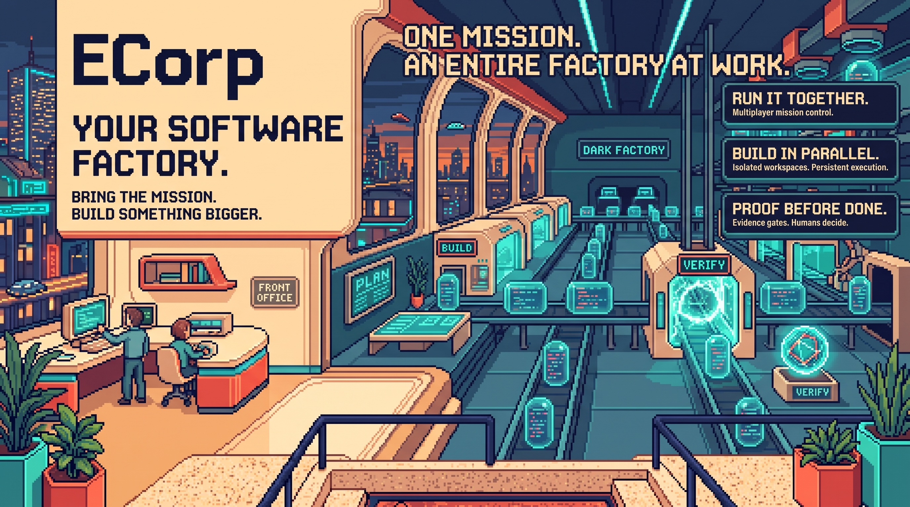

<div align="center">

<a href="https://ecorp-front-office.shyam-sridhar16.chatgpt.site">
  
</a>

<h1>Run an AI company on top of your codebase.</h1>

<p><strong>ECorp. An entire factory. A beautiful front office.</strong></p>

<p>Your repository is the office. Your backlog is the mission board. Your agents are the crew.<br>Bring the mission. Build something bigger. Stay in charge.</p>

<p>
<a href="https://ecorp-front-office.shyam-sridhar16.chatgpt.site"><strong>ENTER THE FRONT OFFICE</strong></a> ·
<a href="#start-locally">RUN ECORP</a> ·
<a href="#how-the-factory-works">HOW IT WORKS</a> ·
<a href="docs/README.md">READ THE HANDBOOK</a> ·
<a href="docs/SECURITY.md">TRUST & SAFETY</a>
</p>

<p><sub>Active alpha. Real provider sessions. Human authority. Evidence before done.</sub></p>

</div>

**Mr. Robot-scale ambition. World's Best Boss energy.** ECorp brings GitHub Copilot, OpenAI Codex,
Claude Code, and OpenCode into one shared software factory: scoped missions, isolated worktrees,
live collaboration, and results that have to prove themselves.

## Meet the front office

**[Explore the interactive ECorp product site →](https://ecorp-front-office.shyam-sridhar16.chatgpt.site)**

Walk through the vision, meet the runtimes, and try the guided mission tour before setting up the
product. The tour is an illustrative browser experience: it does not start agents, connect to your
repository, or approve real actions. To run actual missions, [start ECorp locally](#start-locally).

## The vision: a company you can actually run

Give your AI crew a place to work together, not just a place to talk. ECorp's ambition is a
persistent company around your codebase: people set direction, agents take bounded assignments,
and the organization retains the work, decisions, and evidence after every session.

**Run it together. Build in parallel. Proof before done.** That is both the promise and the
engineering contract. Here is what the current alpha can do.

## Press START on real work

1. **Drop the mission.** Define the outcome, references, write scope, provider, model, budget, and verifier policy.
2. **Build the crew.** Choose a solo worker, two specialists followed by synthesis, or a three-worker Copilot studio with verified handoffs before integration.
3. **Light up isolated worktrees.** Every write-capable run gets its own branch and linked workspace. Parallel agents never pile into the configured source checkout.
4. **Keep human hands on the controls.** Watch live state, steer the active session, queue direction, review the run, or hit an audited emergency stop.
5. **Make proof mandatory.** Files, commands, tests, schemas, screenshots, human approval, and independent review can all block completion.
6. **Launch the verified pull request.** Export the exact patch, archive, typed artifact set, commit and branch bundle, or review report that passed. For factory missions, a separately authorized publisher opens one recoverable PR from that result.

Publication never enables auto-merge and does not merge or deploy.

## How the factory works

[](docs/assets/architecture/ecorp-architecture-retro-v2.jpg)

**One company. Three planes.** The **experience plane** is your shared front office. The
**control plane** owns missions, policy, and durable state. The **execution plane** runs the crew
in isolated worktrees, verifies the output, and returns the evidence. Human authorization and a
trusted publisher take verified artifacts to a pull request—not an automatic merge or deployment.

Click the image for full resolution. This is a logical architecture view; worktrees are not full
OS sandboxes. Explore the [architecture](docs/ARCHITECTURE.md),
[security boundaries](docs/SECURITY.md), and [artwork provenance](docs/assets/architecture/README.md).

## The office is operational

The floor makes real work visible. Agent activity, mission status, approvals, and verification
results are projections of authoritative server, runner, and provider state.

- **State survives the screen.** Missions, messages, task graphs, budgets, approvals, and audit events persist in Postgres. Closing the browser or desktop client does not terminate the run.
- **Work stays off the source checkout.** An outbound-connected runner owns provider processes, isolated worktrees, verification, and artifact collection. The server never executes agent shell commands.
- **Proof opens the exit.** A run cannot emit accepted completion until its persisted verifier policy passes. Verified factory results can then enter the separately authorized publication lane.

### Assemble a studio, not a static cast

ECorp creates mission-owned workers from the connected runner's capabilities. Choose **Studio team ·
3 Copilot agents** for visual, gameplay, and quality specialists working in parallel. Their exact
verified handoff files feed a later integration pass by the gameplay worker.

That is **three workers, four tasks, and four isolated task worktrees**—not a fourth concurrent
agent or three agents editing the same checkout. Unpinned mission workers retire when their mission
is terminal and no live control or cleanup obligations remain; their history stays available.
The [studio implementation and recorded evidence](docs/evidence/2026-09-06-mission-staffing.md)
spell out the checks and remaining staffing work.

Want to start later? Expand **Model, limits and output**, choose **Save without starting**, then
**Save plan**. It is stored on the server as **Awaiting dispatch**.
It stays held across browser closure and server restart until an authorized launch.
Adding custom tests or a reviewer does not silently switch a build into a held plan.
In the normal build form, the deterministic **Test harness** is available only when
**Developer fixtures** is explicitly enabled; an unavailable coding agent never silently becomes
a simulated application build.

## Bring your agents

| Runtime | Governed ECorp path |
| --- | --- |
| **GitHub Copilot** | Official SDK, live account model discovery, model and reasoning selection, streaming, steering, interruption, durable approvals, usage, evidence, and resumable sessions. |
| **OpenAI Codex** | Native app-server lifecycle with structured output, live steering, interruption, stop, resume, usage, and repository-change evidence. |
| **Claude Code** | Windows external-CLI execution with durable stdio approval mediation, streaming, interruption, stop, resume, usage, and common evidence. |
| **OpenCode** | Windows plugin-free external-CLI execution through the same runner, worktree, budget, and evidence contracts. |
| **Deterministic harness** | Quota-free lifecycle fixture for orchestration, verification, approvals, budgets, retries, and failure paths. |

The provider is not the control plane. Runners advertise their exact capabilities, and ECorp dispatches only when the requested adapter, model, reasoning effort, and workspace identity are compatible.

Claude Code runs without user plugins, hooks, MCP servers, browser integration, slash commands, or
auto-memory. Its supported stream-JSON permission requests are bridged into durable ECorp approvals.
Windows external-CLI sessions use owned Job Objects and fail-closed descendant teardown. Those
adapters currently refuse to start on Unix rather than claim equivalent containment. Provider-home
isolation and stronger sandboxing remain separate work in
[#51](https://github.com/shyamsridhar123/ecorp/issues/51); see the
[process-lifecycle evidence](docs/evidence/2026-09-03-external-provider-fail-closed.md).

ECorp is an independent project. Provider names identify integrations, not ownership, sponsorship,
or endorsement.

## Evidence is the finish line

An adapter saying "done" is not enough. The runner can require:

- artifact existence, byte limits, media validation, and SHA-256 integrity
- worktree-relative files, direct commands, and test commands
- JSON object keys and PNG or JPEG screenshot evidence
- role-gated human approval or independent review
- a portable source deliverable linked to the exact verification digest

Artifact bytes move through bounded staging, content-addressed storage, signed provenance, authorized download, and crash-safe reconciliation. Read the full guarantees in [Security](docs/SECURITY.md) and [Architecture](docs/ARCHITECTURE.md).

## Start locally

**Prerequisites:** repository access, Git, Rust 1.94 or newer, Node.js compatible with the pinned
pnpm/Vite toolchain, pnpm 11.19.0, Docker with Compose, and PowerShell 7.4+ on Windows. Provider credentials
are optional for the deterministic harness; real-agent work requires the selected provider's access.

```powershell
git clone https://github.com/shyamsridhar123/ecorp.git
cd ecorp
pnpm install --frozen-lockfile
pwsh -NoProfile -File ./tools/start_local.ps1
```

Open **http://127.0.0.1:5187** by default, or the retained address printed by the command.
Start reuses healthy owned services and starts only missing ones. It keeps the database, native
runner identity, provider home, worktrees and diagnostics rather than resetting them.
An explicitly supplied `DATABASE_URL` uses that database without starting Docker; otherwise,
first-time local setup uses the workspace's managed Compose database.
This is your local ECorp console, not the public product-site tour. Use the
[five-step mission guide](docs/USER_AND_DEVELOPER_JOURNEY.md) for repository confirmation, staffing,
verification, and review.

To start the configured trusted GitHub Project watcher with the same stack:

```powershell
$env:ECORP_FACTORY_WATCH = '1'
$env:ECORP_FACTORY_ADAPTER = 'github-copilot'
pwsh -NoProfile -File ./tools/start_local.ps1
```

Adding a missing Factory worker does not restart a healthy API, runner or UI. Startup checks the
configured controller's heartbeat and preserves its existing paused/running intent.
Pause stops new intake without interrupting active missions. GitHub authentication remains in the
controller process; it is not forwarded to runners or agents.

Normal start is not a restart. To deliberately restart owned services, or stop them:

```powershell
pwsh -NoProfile -File ./tools/start_local.ps1 -Restart
pwsh -NoProfile -File ./tools/stop_local.ps1
```

Neither command removes the database, credentials, worktrees or historical logs. Process control
checks executable, creation time and workspace; old numeric-only PID files do not authorize a kill.
See [local startup and recovery](CONTRIBUTING.md#local-startup-and-recovery) for configured ports,
existing identities and trusted environment settings.

### Point ECorp at another repository

```powershell
$env:CRONY_SOURCE_REPOSITORY = 'C:\path\to\your\repository'
$env:CRONY_SOURCE_BASE_REF = 'HEAD'
pwsh -NoProfile -File ./tools/start_local.ps1 -Restart
```

The runner validates the repository and base ref before accepting work. Mission worktrees are created beneath `CRONY_RUNNER_WORKSPACE`, never in the configured source checkout.

In Missions, use **Describe & setup** to enter the goal and confirm the exact repository, ref, and immutable
commit before launch. ECorp filters runtimes to runners serving that source and persists the tuple
in every task and run. Use a separate dogfood repository for disposable application scenarios
rather than selecting the ECorp product repository.
Then use **Review & build** to inspect the current server-derived plan and completion checks.
**Build** creates and launches the mission; model, budget, output and detailed requirements remain
available in optional disclosures.

### Run the repository checks

```powershell
pnpm check
```

This runs migration checks, Rust formatting, Clippy, the workspace test suite, and the web build and lint.

## Run a GitHub issue through the factory

[GitHub Project #3](https://github.com/users/shyamsridhar123/projects/3) is the live planning and status source for **ECorp Build**. `docs/BACKLOG.md` is historical context, not the execution queue.

An issue is eligible when it is open, in `Todo`, labeled `factory:ready`, and has no open `Blocked by` dependency. Preview the exact intake without mutating GitHub:

```powershell
cargo run -p crony-cli -- factory `
  <corp-id> <actor-id> `
  --adapter codex `
  --budget-tokens 500000 `
  --budget-cost-microusd 1000000 `
  --issue <issue-number> `
  --dry-run
```

Remove `--dry-run` to claim the issue, pin its immutable source commit, create the mission, move the Project item to `In Progress`, and dispatch a compatible runner.

After independent verification, an authorized operator with an enrolled publisher credential can publish the exact commit and branch deliverable:

```powershell
$PublisherId = "crony-cli:$env:COMPUTERNAME"
$PublisherCredentialPath = Join-Path $env:USERPROFILE '.ecorp-publisher\publisher.credential'
$WorkItemId = '<factory-work-item-id>'

cargo run -p crony-cli -- factory-publish `
  00000000-0000-4000-8000-000000000001 `
  00000000-0000-4000-8000-000000000011 `
  $WorkItemId `
  --publisher-id $PublisherId `
  --publisher-credential-file $PublisherCredentialPath `
  --authorization-reason "Publish the verified result for review."
```

Duplicate calls, process restart, and partial remote success recover the same branch and pull
request. Project status enters review only after the pull request exists. Publication never enables
auto-merge and does not merge or deploy. Create a short-lived credential before publication, then
revoke it and delete its plaintext file immediately afterward; see the
[dark-factory contributor guide](docs/DARK_FACTORY_CONTRIBUTOR_GUIDE.md).

## Current state and boundaries

ECorp is an active alpha. The working path includes the React control floor, Rust control plane, Postgres event journal, outbound runner, provider adapters, mission contracts, bounded task graphs, worktree isolation, approvals, circuit breakers, evidence-gated completion, portable source deliverables, governed GitHub Project intake, and authorized pull request publication.

Portable deliverables and publication are implemented, not roadmap promises. See the [portable deliverables evidence](docs/evidence/2026-09-02-portable-deliverables.md) and [publication evidence](docs/evidence/2026-09-02-idempotent-pull-request-publication.md).

Current boundaries:

- ECorp is not yet a safe sandbox for fully untrusted child processes. Worktree isolation and
  Windows external-CLI process containment do not provide a complete filesystem or network sandbox.
- Development mode uses fixed demo identities, permissive local CORS, a deterministic process running with the local user's permissions, and no network sandbox.
- External CLI adapters have platform and assurance limits. Claude's durable stdio permission
  bridge and fail-closed Windows process-tree teardown are implemented. Isolated provider homes,
  inherited-environment allowlisting, and stronger containment remain in
  [#51](https://github.com/shyamsridhar123/ecorp/issues/51). Unix external-CLI execution is disabled.
- Production deployments require OIDC, deployment-managed keys, explicit runner enrollment, private S3-compatible artifact storage, and an intentional network policy.
- The public product is **ECorp**. Existing `crony-*` binaries, `CRONY_` environment variables, and `X-Crony-*` headers remain for compatibility during the transition.

The September 1, 2026 enterprise dogfood report captures the gaps found on that date. Use [GitHub Project #3](https://github.com/users/shyamsridhar123/projects/3) and linked issues for current status.

## Documentation

**[Open the ECorp documentation hub](docs/README.md)** for the product journey, developer setup,
architecture decisions, branding, and dated evidence. Implementation, historical results, and
future intent are kept separate.

| Goal | Read |
| --- | --- |
| Explore the vision before setup | [Interactive front office](https://ecorp-front-office.shyam-sridhar16.chatgpt.site) |
| Contribute without conflicting with another mission | [Contributing](CONTRIBUTING.md) and the [dark-factory contributor guide](docs/DARK_FACTORY_CONTRIBUTOR_GUIDE.md) |
| Operate a first mission | [User and developer journey](docs/USER_AND_DEVELOPER_JOURNEY.md) |
| Work on the actual console or desktop shell | [Web client](apps/web/README.md) and [desktop shell](apps/desktop/README.md) |
| Understand the planes and state model | [Architecture](docs/ARCHITECTURE.md) |
| Review shipped controls and current limits | [Security](docs/SECURITY.md) and [threat model](docs/THREAT_MODEL.md) |
| Inspect the evidence standard | [Evaluation strategy](docs/EVALS.md) |
| Understand product intent and technical direction | [Product and technical plan](docs/PRODUCT_AND_TECHNICAL_PLAN.md) |
| Reuse the approved hero and brand voice | [Brand and product-site guide](docs/BRAND_AND_PRODUCT_SITE.md) |
| Follow live work | [ECorp Build, GitHub Project #3](https://github.com/users/shyamsridhar123/projects/3) |
| Read historical planning context | [Backlog seed](docs/BACKLOG.md) |

## License

Apache-2.0. See [LICENSE](LICENSE) and [NOTICE](NOTICE).
