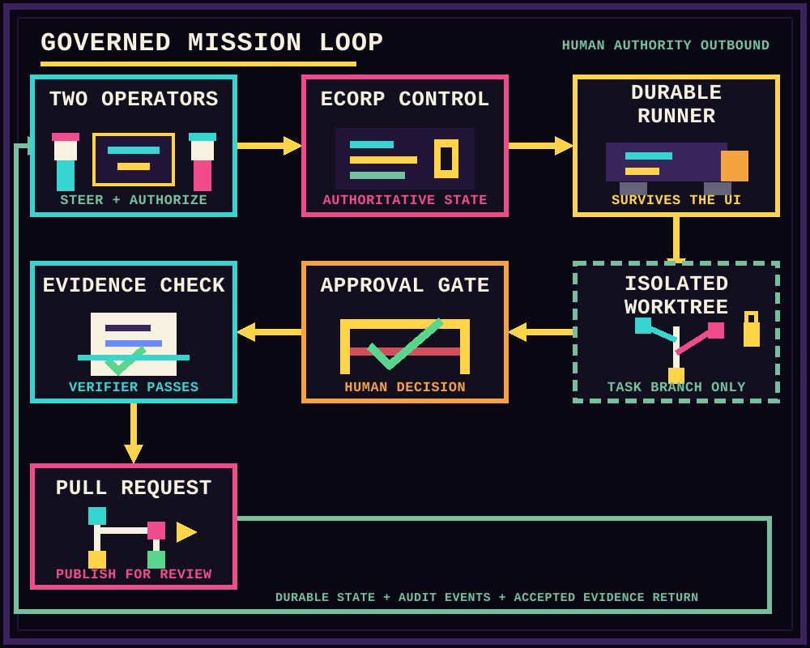

<div align="center">

<h1>ECorp</h1>

<p><strong>Run a governed AI crew on your repository.</strong></p>

<p>Turn one mission into parallel agent work, human approvals, verified deliverables, and a review-ready pull request.</p>

<p>
<a href="#start-locally">Start locally</a> |
<a href="#how-ecorp-runs-a-mission">Follow a mission</a> |
<a href="#bring-your-agents">Choose a provider</a> |
<a href="#documentation">Read the docs</a>
</p>

<picture>
  <source media="(prefers-reduced-motion: reduce)" srcset="./docs/assets/readme/ecorp-arcade-hero-static.png">
  
</picture>

<p><sub><a href="./docs/assets/readme/ecorp-arcade-hero-static.png">Open the static hero image</a> for reduced-motion viewing.</sub></p>

</div>

ECorp is a multiplayer command center for repository work. Humans define the contract, agents execute on trusted runners, and evidence decides what can ship.

## How ECorp runs a mission

1. **Set the contract.** Define the outcome, references, write scope, provider, model, budget, and verifier policy.
2. **Plan the crew.** Run one focused worker or two independent specialists followed by dependency-gated synthesis.
3. **Work in isolation.** Every write-capable run receives a dedicated branch and linked Git worktree. The runner survives every UI client.
4. **Operate together.** Multiple humans share live state while one controller holds the steering lease. Others can queue direction, review the run, or issue a permitted emergency stop.
5. **Accept proof.** Files, commands, tests, schemas, screenshots, human approval, and independent review can block completion.
6. **Publish deliberately.** Export a patch, archive, typed artifact set, commit and branch bundle, or review report. An authorized publisher can turn the exact verified branch into one recoverable pull request.

Publication never enables auto-merge and does not merge or deploy.

## What the control floor controls

| On screen | Operational truth |
| --- | --- |
| **Sprite office** | Crew movement and state come from real server, runner, and provider events. The floor is a projection, not the system of record. |
| **Mission room** | Specifications, messages, task graphs, approvals, decisions, budgets, and audit events persist in Postgres. |
| **Runner cabinet** | An outbound-connected daemon owns provider processes, worktrees, verification, and artifact collection. The server never executes agent shell commands. |
| **Review gate** | A run cannot emit accepted completion until its persisted verifier policy passes. |
| **Publication lane** | Verified factory results can be pushed to a bounded branch and opened as an idempotent pull request after explicit authorization. |

<p align="center">
  
</p>

Closing the browser or desktop client does not terminate an active run.

## Bring your agents

| Runtime | Governed ECorp path |
| --- | --- |
| **GitHub Copilot** | Official SDK, live account model discovery, model and reasoning selection, streaming, steering, interruption, durable approvals, usage, evidence, and resumable sessions. |
| **OpenAI Codex** | Native app-server lifecycle with structured output, live steering, interruption, stop, resume, usage, and repository-change evidence. |
| **Claude Code** | Plugin-free normalized CLI execution with streaming, interruption, stop, resume, usage, and common evidence. |
| **OpenCode** | Plugin-free normalized CLI execution through the same runner, worktree, budget, and evidence contracts. |
| **Deterministic harness** | Quota-free lifecycle fixture for orchestration, verification, approvals, budgets, retries, and failure paths. |

The provider is not the control plane. Runners advertise their exact capabilities, and ECorp dispatches only when the requested adapter, model, reasoning effort, and workspace identity are compatible.

Claude Code runs without user plugins, hooks, MCP servers, browser integration, slash commands, or auto-memory. Its provider permission prompts are not yet bridged through ECorp's durable approval lifecycle. [Issue #110](https://github.com/shyamsridhar123/ecorp/issues/110) tracks that boundary.

## Evidence is the finish line

An adapter saying "done" is not enough. The runner can require:

- artifact existence, byte limits, media validation, and SHA-256 integrity
- worktree-relative files, direct commands, and test commands
- JSON object keys and PNG or JPEG screenshot evidence
- role-gated human approval or independent review
- a portable source deliverable linked to the exact verification digest

Artifact bytes move through bounded staging, content-addressed storage, signed provenance, authorized download, and crash-safe reconciliation. Read the full guarantees in [Security](docs/SECURITY.md) and [Architecture](docs/ARCHITECTURE.md).

## Start locally

**Prerequisites:** Rust, Node.js, pnpm, Docker, and Windows PowerShell. Provider credentials are optional. The deterministic harness runs without them.

```powershell
git clone https://github.com/shyamsridhar123/ecorp.git
cd ecorp
pnpm install --frozen-lockfile
./tools/start_local.ps1
```

Open **http://127.0.0.1:5187**. The script starts Postgres, the Rust control plane, an enrolled outbound runner, and the React operations console, then checks service health and runner connectivity.

Stop the stack with:

```powershell
./tools/stop_local.ps1
```

### Point ECorp at another repository

```powershell
$env:CRONY_SOURCE_REPOSITORY = 'C:\path\to\your\repository'
$env:CRONY_SOURCE_BASE_REF = 'HEAD'
./tools/start_local.ps1
```

The runner validates the repository and base ref before accepting work. Mission worktrees are created beneath `CRONY_RUNNER_WORKSPACE`, never in the configured source checkout.

### Run the repository checks

```powershell
pnpm check
```

This runs migration checks, Rust formatting, Clippy, the workspace test suite, and the web build and lint.

## Run a GitHub issue through the factory

[GitHub Project #3](https://github.com/users/shyamsridhar123/projects/3) is the live planning and status source for **ECorp Build**. `docs/BACKLOG.md` is historical context, not the execution queue.

An issue is eligible when it is open, in `Todo`, labeled `factory:ready`, and has no open `Blocked by` dependency. Preview the exact intake without mutating GitHub:

```powershell
cargo run -p crony-cli -- factory `
  <corp-id> <actor-id> `
  --adapter codex `
  --budget-tokens 500000 `
  --budget-cost-microusd 1000000 `
  --issue <issue-number> `
  --dry-run
```

Remove `--dry-run` to claim the issue, pin its immutable source commit, create the mission, move the Project item to `In Progress`, and dispatch a compatible runner.

After independent verification, an authorized operator with an enrolled publisher credential can publish the exact commit and branch deliverable:

```powershell
cargo run -p crony-cli -- factory-publish `
  <corp-id> <actor-id> <factory-work-item-id> `
  --publisher-credential-file <path> `
  --authorization-reason "Publish the verified result for review."
```

Duplicate calls, process restarts, and partial remote success recover the same branch and pull request. Project status enters review only after the pull request exists. See the [user and developer journey](docs/USER_AND_DEVELOPER_JOURNEY.md) for the complete operator flow.

## Current state and boundaries

ECorp is an active alpha. The working path includes the React control floor, Rust control plane, Postgres event journal, outbound runner, provider adapters, mission contracts, bounded task graphs, worktree isolation, approvals, circuit breakers, evidence-gated completion, portable source deliverables, governed GitHub Project intake, and authorized pull request publication.

Portable deliverables and publication are implemented, not roadmap promises. See the [portable deliverables evidence](docs/evidence/2026-09-02-portable-deliverables.md) and [publication evidence](docs/evidence/2026-09-02-idempotent-pull-request-publication.md).

Current boundaries:

- ECorp is not yet a safe sandbox for fully untrusted child processes. Stronger OS or container isolation and descendant-process verification remain open.
- Development mode uses fixed demo identities, permissive local CORS, a deterministic process running with the local user's permissions, and no network sandbox.
- External CLI adapters remain lower assurance than the GitHub Copilot SDK path. Claude's durable permission bridge is tracked in [#110](https://github.com/shyamsridhar123/ecorp/issues/110).
- Production deployments require OIDC, deployment-managed keys, explicit runner enrollment, private S3-compatible artifact storage, and an intentional network policy.
- The public product is **ECorp**. Existing `crony-*` binaries, `CRONY_` environment variables, and `X-Crony-*` headers remain for compatibility during the transition.

The September 1, 2026 enterprise dogfood report captures the gaps found on that date. Use [GitHub Project #3](https://github.com/users/shyamsridhar123/projects/3) and linked issues for current status.

## Documentation

| Goal | Read |
| --- | --- |
| Operate a first mission | [User and developer journey](docs/USER_AND_DEVELOPER_JOURNEY.md) |
| Understand the planes and state model | [Architecture](docs/ARCHITECTURE.md) |
| Review shipped controls and current limits | [Security](docs/SECURITY.md) and [threat model](docs/THREAT_MODEL.md) |
| Inspect the evidence standard | [Evaluation strategy](docs/EVALS.md) |
| Understand product intent and technical direction | [Product and technical plan](docs/PRODUCT_AND_TECHNICAL_PLAN.md) |
| Follow live work | [ECorp Build, GitHub Project #3](https://github.com/users/shyamsridhar123/projects/3) |
| Read historical planning context | [Backlog seed](docs/BACKLOG.md) |

## License

Apache-2.0. See [LICENSE](LICENSE) and [NOTICE](NOTICE).
