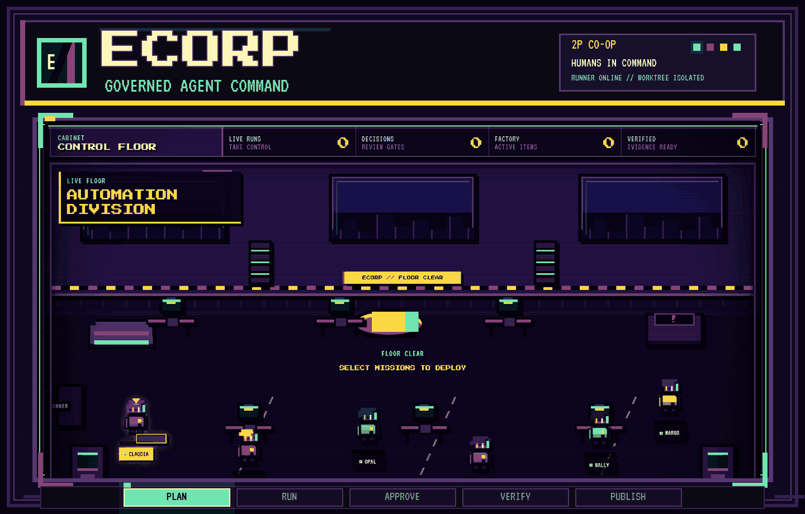

<div align="center">

<picture>
  <source media="(prefers-reduced-motion: reduce)" srcset="./docs/assets/readme/ecorp-arcade-hero-static.png">
  
</picture>

<h1>Turn your repository into a live AI company.</h1>

<p><strong>Agents take the floor. Humans hold the keys. Evidence unlocks the pull request.</strong></p>

<p>Dispatch GitHub Copilot, OpenAI Codex, Claude Code, and OpenCode into isolated worktrees. Watch the crew split the mission, work in parallel, ask for authority, prove the result, and publish the exact source that passed.</p>

<p>
<a href="#start-locally"><strong>PRESS START</strong></a> |
<a href="#press-start-on-real-work">WATCH THE MISSION</a> |
<a href="#bring-your-agents">CHOOSE THE CREW</a> |
<a href="docs/SECURITY.md">TRUST MODEL</a>
</p>

<p><sub><a href="./docs/assets/readme/ecorp-arcade-hero-static.png">Static hero</a> for reduced-motion viewing.</sub></p>

</div>

Not another agent chat. Not agent theater. ECorp is the durable execution plane behind the arcade: multiplayer control, real provider sessions, human authority, and receipts for every mission.

## Press START on real work

1. **Drop the mission.** Define the outcome, references, write scope, provider, model, budget, and verifier policy.
2. **Build the crew.** Send one focused worker or unleash two independent specialists followed by dependency-gated synthesis.
3. **Light up isolated worktrees.** Every write-capable run gets its own branch and linked workspace. Parallel agents never pile into the configured source checkout.
4. **Keep human hands on the controls.** Watch live state, steer the active session, queue direction, review the run, or hit an audited emergency stop.
5. **Make proof mandatory.** Files, commands, tests, schemas, screenshots, human approval, and independent review can all block completion.
6. **Launch the verified pull request.** Export the exact patch, archive, typed artifact set, commit and branch bundle, or review report that passed. An authorized publisher opens one recoverable PR from that result.

Publication never enables auto-merge and does not merge or deploy.

## The arcade is operational

The floor is not decorative animation. Every sprite, cabinet, alert, approval, and score reflects authoritative server, runner, provider, and verification state.

- **State survives the screen.** Missions, messages, task graphs, budgets, approvals, and audit events persist in Postgres. Closing the browser or desktop client does not terminate the run.
- **Work stays off the source checkout.** An outbound-connected runner owns provider processes, isolated worktrees, verification, and artifact collection. The server never executes agent shell commands.
- **Proof opens the exit.** A run cannot emit accepted completion until its persisted verifier policy passes. Verified factory results can then enter the separately authorized publication lane.

## Bring your agents

| Runtime | Governed ECorp path |
| --- | --- |
| **GitHub Copilot** | Official SDK, live account model discovery, model and reasoning selection, streaming, steering, interruption, durable approvals, usage, evidence, and resumable sessions. |
| **OpenAI Codex** | Native app-server lifecycle with structured output, live steering, interruption, stop, resume, usage, and repository-change evidence. |
| **Claude Code** | Plugin-free normalized CLI execution with durable stdio approval mediation, streaming, interruption, stop, resume, usage, and common evidence. |
| **OpenCode** | Plugin-free normalized CLI execution through the same runner, worktree, budget, and evidence contracts. |
| **Deterministic harness** | Quota-free lifecycle fixture for orchestration, verification, approvals, budgets, retries, and failure paths. |

The provider is not the control plane. Runners advertise their exact capabilities, and ECorp dispatches only when the requested adapter, model, reasoning effort, and workspace identity are compatible.

Claude Code runs without user plugins, hooks, MCP servers, browser integration, slash commands, or auto-memory. Its supported stream-JSON permission requests are bridged into durable ECorp approvals. Complete descendant cleanup and fail-closed teardown remain tracked in [#51](https://github.com/shyamsridhar123/ecorp/issues/51) and [#124](https://github.com/shyamsridhar123/ecorp/issues/124).

## Evidence is the finish line

An adapter saying "done" is not enough. The runner can require:

- artifact existence, byte limits, media validation, and SHA-256 integrity
- worktree-relative files, direct commands, and test commands
- JSON object keys and PNG or JPEG screenshot evidence
- role-gated human approval or independent review
- a portable source deliverable linked to the exact verification digest

Artifact bytes move through bounded staging, content-addressed storage, signed provenance, authorized download, and crash-safe reconciliation. Read the full guarantees in [Security](docs/SECURITY.md) and [Architecture](docs/ARCHITECTURE.md).

## Start locally

**Prerequisites:** Rust, Node.js, pnpm, Docker, and Windows PowerShell. Provider credentials are optional. The deterministic harness runs without them.

```powershell
git clone https://github.com/shyamsridhar123/ecorp.git
cd ecorp
pnpm install --frozen-lockfile
./tools/start_local.ps1
```

Open **http://127.0.0.1:5187**. The script starts Postgres, the Rust control plane, an enrolled outbound runner, and the React operations console, then checks service health and runner connectivity.

To start the configured trusted GitHub Project watcher with the same stack:

```powershell
$env:ECORP_FACTORY_WATCH = '1'
$env:ECORP_FACTORY_ADAPTER = 'github-copilot'
./tools/start_local.ps1
```

When configured, startup waits for a fresh controller heartbeat and Factory displays `Watching`.
Pause stops new intake without interrupting active missions. GitHub authentication remains in the
controller process; it is not forwarded to runners or agents.

Stop the stack with:

```powershell
./tools/stop_local.ps1
```

### Point ECorp at another repository

```powershell
$env:CRONY_SOURCE_REPOSITORY = 'C:\path\to\your\repository'
$env:CRONY_SOURCE_BASE_REF = 'HEAD'
./tools/start_local.ps1
```

The runner validates the repository and base ref before accepting work. Mission worktrees are created beneath `CRONY_RUNNER_WORKSPACE`, never in the configured source checkout.

### Run the repository checks

```powershell
pnpm check
```

This runs migration checks, Rust formatting, Clippy, the workspace test suite, and the web build and lint.

## Run a GitHub issue through the factory

[GitHub Project #3](https://github.com/users/shyamsridhar123/projects/3) is the live planning and status source for **ECorp Build**. `docs/BACKLOG.md` is historical context, not the execution queue.

An issue is eligible when it is open, in `Todo`, labeled `factory:ready`, and has no open `Blocked by` dependency. Preview the exact intake without mutating GitHub:

```powershell
cargo run -p crony-cli -- factory `
  <corp-id> <actor-id> `
  --adapter codex `
  --budget-tokens 500000 `
  --budget-cost-microusd 1000000 `
  --issue <issue-number> `
  --dry-run
```

Remove `--dry-run` to claim the issue, pin its immutable source commit, create the mission, move the Project item to `In Progress`, and dispatch a compatible runner.

After independent verification, an authorized operator with an enrolled publisher credential can publish the exact commit and branch deliverable:

```powershell
$PublisherId = "crony-cli:$env:COMPUTERNAME"
$PublisherCredentialPath = Join-Path $env:USERPROFILE '.ecorp-publisher\publisher.credential'
$WorkItemId = '<factory-work-item-id>'

cargo run -p crony-cli -- factory-publish `
  00000000-0000-4000-8000-000000000001 `
  00000000-0000-4000-8000-000000000011 `
  $WorkItemId `
  --publisher-id $PublisherId `
  --publisher-credential-file $PublisherCredentialPath `
  --authorization-reason "Publish the verified result for review."
```

Duplicate calls, process restart, and partial remote success recover the same branch and pull
request. Project status enters review only after the pull request exists. Publication never enables
auto-merge and does not merge or deploy. Create a short-lived credential before publication, then
revoke it and delete its plaintext file immediately afterward; see the
[dark-factory contributor guide](docs/DARK_FACTORY_CONTRIBUTOR_GUIDE.md).

## Current state and boundaries

ECorp is an active alpha. The working path includes the React control floor, Rust control plane, Postgres event journal, outbound runner, provider adapters, mission contracts, bounded task graphs, worktree isolation, approvals, circuit breakers, evidence-gated completion, portable source deliverables, governed GitHub Project intake, and authorized pull request publication.

Portable deliverables and publication are implemented, not roadmap promises. See the [portable deliverables evidence](docs/evidence/2026-09-02-portable-deliverables.md) and [publication evidence](docs/evidence/2026-09-02-idempotent-pull-request-publication.md).

Current boundaries:

- ECorp is not yet a safe sandbox for fully untrusted child processes. Stronger OS or container isolation and descendant-process verification remain open.
- Development mode uses fixed demo identities, permissive local CORS, a deterministic process running with the local user's permissions, and no network sandbox.
- External CLI adapters remain lower assurance than the GitHub Copilot SDK path. Claude's durable stdio permission bridge is implemented; isolated provider homes, inherited-environment allowlisting, and fail-closed process-tree teardown remain tracked in [#51](https://github.com/shyamsridhar123/ecorp/issues/51) and [#124](https://github.com/shyamsridhar123/ecorp/issues/124).
- Production deployments require OIDC, deployment-managed keys, explicit runner enrollment, private S3-compatible artifact storage, and an intentional network policy.
- The public product is **ECorp**. Existing `crony-*` binaries, `CRONY_` environment variables, and `X-Crony-*` headers remain for compatibility during the transition.

The September 1, 2026 enterprise dogfood report captures the gaps found on that date. Use [GitHub Project #3](https://github.com/users/shyamsridhar123/projects/3) and linked issues for current status.

## Documentation

The September 1, 2026 enterprise-application dogfood pass is recorded in
[`docs/evidence/2026-09-01-enterprise-application-dogfood.md`](docs/evidence/2026-09-01-enterprise-application-dogfood.md).
It validated two generated applications and exposed gaps that are now either landed or represented
by current Project #3 issues.

| Goal | Read |
| --- | --- |
| Contribute without conflicting with another mission | [Contributing](CONTRIBUTING.md) and the [dark-factory contributor guide](docs/DARK_FACTORY_CONTRIBUTOR_GUIDE.md) |
| Operate a first mission | [User and developer journey](docs/USER_AND_DEVELOPER_JOURNEY.md) |
| Understand the planes and state model | [Architecture](docs/ARCHITECTURE.md) |
| Review shipped controls and current limits | [Security](docs/SECURITY.md) and [threat model](docs/THREAT_MODEL.md) |
| Inspect the evidence standard | [Evaluation strategy](docs/EVALS.md) |
| Understand product intent and technical direction | [Product and technical plan](docs/PRODUCT_AND_TECHNICAL_PLAN.md) |
| Follow live work | [ECorp Build, GitHub Project #3](https://github.com/users/shyamsridhar123/projects/3) |
| Read historical planning context | [Backlog seed](docs/BACKLOG.md) |

## License

Apache-2.0. See [LICENSE](LICENSE) and [NOTICE](NOTICE).
