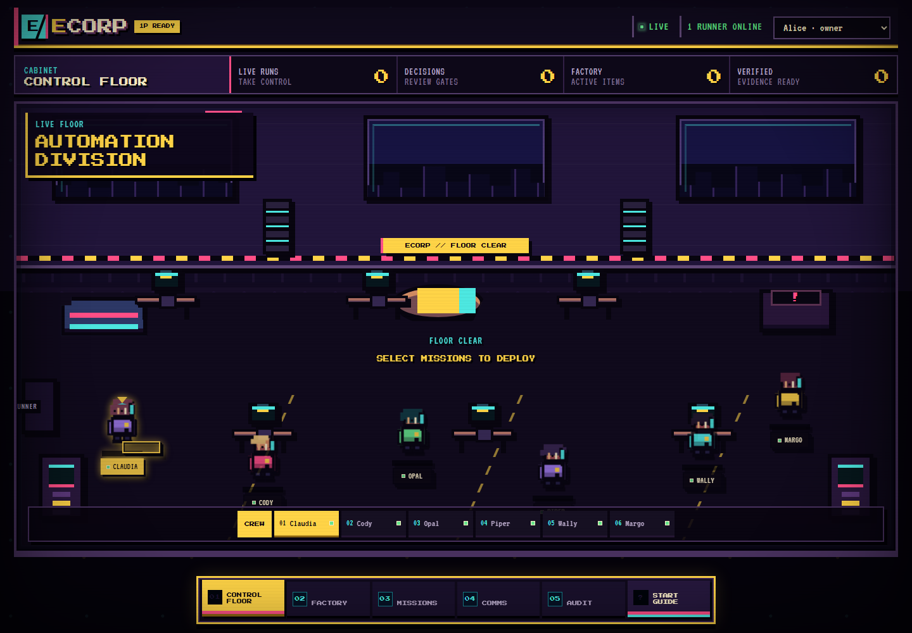

<div align="center">


<h1>ECORP</h1>

<h3>Run an AI company on top of your codebase.</h3>

<p><strong>Give ECorp a Git repository. It gives your agents a mission control room.</strong></p>

<p>
Dispatch GitHub Copilot, OpenAI Codex, Claude Code, OpenCode, and deterministic workers into
isolated worktrees. Watch the work live. Steer active sessions. Approve risky actions. Accept only
evidence-backed results.
</p>

<p><strong>One repository. Multiple agents. Human authority. Receipts for every mission.</strong></p>

<p>


</p>

</div>



<p align="center"><sub><strong>PLAYABLE CONTROL FLOOR:</strong> server-backed crew sprites inhabit one game world, agent commands open in context, and the bottom dock switches focused cabinets.</sub></p>

<p align="center"><strong>Meet Relay.</strong> Part dispatcher, part safety officer, always asking for evidence.</p>

## Not another agent chat. An operating system for agent work.

Most agent tools disappear behind a terminal or a conversation. ECorp turns repository work into a
durable operating process that humans can see, control, and audit.

| You get | What it means |
| --- | --- |
| **A live control floor** | Agent movement, status, review, and approval states are projections of real provider sessions—not decorative animation. |
| **Your choice of intelligence** | Select a connected runtime, an account-enabled GitHub Copilot model, and supported reasoning effort for each mission. |
| **Safe parallel execution** | ECorp assigns every write-capable run its own Git branch and linked worktree. Provider-global hooks and process trees are not fully contained yet, so fully untrusted child processes remain unsupported and tracked in #51. |
| **Human authority at the point of risk** | Steer live work, interrupt a turn, transfer control, approve scoped actions, or issue an audited emergency stop. |
| **Proof before completion** | Artifacts, files, commands, tests, schemas, screenshots, human approval, and independent review can gate success. |
| **Durable operations** | Missions, rooms, messages, approvals, budgets, events, provider sessions, and signed artifact metadata survive the browser session. |

## From repository to evidence-gated run

```text
1. Point ECorp at a Git repository
                  ↓
2. Define the outcome, runtime, model, strategy, and safety budget
                  ↓
3. ECorp creates bounded tasks and isolated worktrees
                  ↓
4. Agents execute while humans watch, steer, and approve
                  ↓
5. Verification runs before the mission can complete
                  ↓
6. ECorp records provider output, accepted evidence, provenance, and audit trail
```

Choose one focused agent or run two independent specialists followed by a dependency-gated
synthesis task. The scheduler releases only ready work, matches it to a compatible connected
runner, and keeps retries, depth, fan-out, tokens, and cost inside explicit bounds.

The currently accepted artifact may be a provider evidence envelope rather than the application
source itself. Exporting an exact source archive, patch, commit, or merge-ready branch is tracked in
#53.

## Bring the agents you already trust

| Runtime | ECorp integration |
| --- | --- |
| **GitHub Copilot** | Official SDK integration, live account model discovery, model and reasoning selection, streaming, steering, interruption, approvals, usage, evidence, and resumable sessions. |
| **OpenAI Codex** | Native app-server lifecycle with structured output, live steering, interrupt, stop, resume, usage, and repository-change evidence. |
| **Claude Code** | Normalized CLI execution with streaming, interruption, stop, resume, and common evidence. |
| **OpenCode** | Normalized CLI execution through the same governed runner and evidence contract. |
| **Deterministic harness** | Quota-free, no-AI lifecycle fixture for testing orchestration, verification, approvals, budgets, and failure paths. |

The provider is not the control plane. Runners advertise exactly what they support, and ECorp
dispatches only when the requested adapter, model, and reasoning capability are available.

Claude Code now launches without user plugins, MCP servers, browser integration, hooks, or
auto-memory. Its shell-permission requests and descendant-process cleanup are not yet bridged
through the durable ECorp approval lifecycle; that remaining boundary is tracked in GitHub issue
#51. Do not treat normalized external-CLI execution as equivalent to the Copilot SDK approval path.

## Control without surrendering the repository

```text
Web console · Tauri desktop · CLI · MCP / ACP / A2A
                         │
                    REST + WebSocket
                         ▼
              ┌─────────────────────┐
              │ ECorp control plane │
              │ missions · policy   │
              │ rooms · approvals   │
              │ events · artifacts  │
              └──────────┬──────────┘
                         │ fenced, outbound assignments
                         ▼
              ┌─────────────────────┐
              │ trusted runner node │
              │ provider supervisor │
              │ isolated worktrees  │
              └──────────┬──────────┘
                         ▼
                verification + signed evidence
```

The server never executes an agent shell command. Outbound-connected runner daemons own provider
processes, worktree isolation, artifact collection, and verification. Postgres remains the
authoritative state and event journal, so closing the UI does not terminate active work.

## Safety is part of the workflow

- **Deny-by-default access:** production OIDC identity, Corp-scoped RBAC, room membership, and
  one-time WebSocket tickets.
- **Revocable runner identity:** short-lived enrollment, rotating workload credentials, replay
  rejection, reconnect grace, and fenced assignments.
- **Scoped secrets:** encrypted at rest and released only for an authorized actor, task, run,
  runner, tool, resource, and expiry window.
- **Durable approvals:** ambiguous, external, networked, or policy-controlled actions pause until
  an authorized human decides.
- **Circuit breakers:** run, mission, requester, and Corp budgets can steer, constrain, suspend, or
  stop runaway work.
- **Artifact provenance:** content-addressed storage, SHA-256 integrity, media validation,
  atomic staging, crash-safe metadata finalization, retention metadata, HMAC-signed provenance,
  and authorized downloads.

Read the exact boundaries in [`docs/SECURITY.md`](docs/SECURITY.md) and
[`docs/THREAT_MODEL.md`](docs/THREAT_MODEL.md).

## Start locally

### Fastest path: Windows PowerShell

Prerequisites: Rust, Node.js, pnpm, Docker, and at least one optional authenticated provider CLI or
GitHub Copilot account. The deterministic harness works without provider credentials.

```powershell
git clone https://github.com/shyamsridhar123/ecorp.git
cd ecorp
./tools/start_local.ps1
```

Open **http://127.0.0.1:5187**.

The startup script launches Postgres, the Rust control plane, an enrolled outbound runner, and the
React operations console.

### Point ECorp at another repository

```powershell
$env:CRONY_SOURCE_REPOSITORY = 'C:\path\to\your\repository'
$env:CRONY_SOURCE_BASE_REF = 'HEAD'
./tools/start_local.ps1
```

The runner validates the repository and base ref at startup. Each mission then receives a dedicated
worktree beneath `CRONY_RUNNER_WORKSPACE`.

### Run the engineering checks

```powershell
pnpm install --frozen-lockfile
pnpm check
```

### Run a GitHub Project issue through the factory

The controller reads the **ECorp Build** GitHub Project, not `docs/BACKLOG.md`. An issue is eligible
when it is open, in `Todo`, labeled `factory:ready`, and has no open `Blocked by` dependencies.

With the local stack running and GitHub CLI authenticated:

```powershell
cargo run -p crony-cli -- factory `
  00000000-0000-4000-8000-000000000001 `
  00000000-0000-4000-8000-000000000011 `
  --owner shyamsridhar123 `
  --project-number 3 `
  --repository shyamsridhar123/ecorp `
  --source-base-ref HEAD `
  --publication-base-ref main `
  --adapter codex `
  --budget-tokens 500000 `
  --budget-cost-microusd 1000000 `
  --issue 123 `
  --dry-run
```

Remove `--dry-run` to claim the issue, atomically create its mission, move the Project item to
`In Progress`, and dispatch the runner. Repeating the command recovers the durable work item rather
than creating another mission. The connected runner must advertise the same GitHub repository,
source base ref, and immutable source commit or dispatch fails closed.

After the factory item reaches `verified`, an owner, admin, or manager can publish the exact signed
commit/branch deliverable through the trusted GitHub CLI boundary:

```powershell
cargo run -p crony-cli -- factory-publish `
  00000000-0000-4000-8000-000000000001 `
  00000000-0000-4000-8000-000000000011 `
  <factory-work-item-id> `
  --authorization-reason "Publish the verified result for review."
```

Duplicate calls, process restart, and partial remote success recover the same branch and pull
request. Project status enters review only after the pull request exists. Publication never enables
auto-merge and does not merge or deploy.

## What to try first

1. Choose **GitHub Copilot**, **Codex**, **Claude Code**, or **OpenCode**.
2. Select a model, reasoning effort, and mission budget when the provider exposes them.
3. Enter a concise mission title. Durable specifications and operator-authored verifier policies
   are tracked in #52.
4. Use **One agent** for a focused build or **Two specialists, then synthesis** for competing
   approaches.
5. Keep **Pause after planning** enabled when you want to inspect the task graph before dispatch.
6. Approve scoped actions directly inside the mission card.
7. Download the accepted evidence and source deliverable when the mission completes.
8. Publish a verified factory commit/branch deliverable as one recoverable pull request.

Example mission:

> Build a browser-playable multiplayer game with power-ups and boss battles. Test the complete
> gameplay loop, attach browser evidence, and do not modify files outside the assigned worktree.

## Current state

ECorp is an active alpha with a working web console, Rust control plane, Postgres event journal,
outbound runner, provider adapters, thin Tauri desktop shell, protocol gateways, approval system,
budget circuit breakers, worktree isolation, evidence-gated completion, and governed GitHub
Project-to-mission factory intake.

It is not yet a safe sandbox for fully untrusted child processes. Development mode intentionally
includes fixed demo identities, permissive local CORS, and a deterministic process that runs with
the local user's permissions. Production deployments require OIDC, deployment-managed keys,
explicit runner enrollment, and private S3-compatible artifact storage.

The September 1, 2026 enterprise-application dogfood pass is recorded in
[`docs/evidence/2026-09-01-enterprise-application-dogfood.md`](docs/evidence/2026-09-01-enterprise-application-dogfood.md).
It validated two generated applications and exposed open gaps in budget recovery, provider
isolation and permissions, rich mission contracts, and portable merge-ready deliverables.

The public product is **ECorp**. Existing `crony-*` binaries, `CRONY_` environment variables, and
`X-Crony-*` headers remain supported for compatibility during the transition.

## Go deeper

- [User and developer journey](docs/USER_AND_DEVELOPER_JOURNEY.md)
- [Architecture](docs/ARCHITECTURE.md)
- [Security](docs/SECURITY.md)
- [Threat model](docs/THREAT_MODEL.md)
- [Evaluation strategy](docs/EVALS.md)
- [Product and technical plan](docs/PRODUCT_AND_TECHNICAL_PLAN.md)
- [ECorp Build — operational source of truth](https://github.com/users/shyamsridhar123/projects/3)
- [Historical backlog seed](docs/BACKLOG.md)

## License

Apache-2.0. See [`LICENSE`](LICENSE) and [`NOTICE`](NOTICE).
