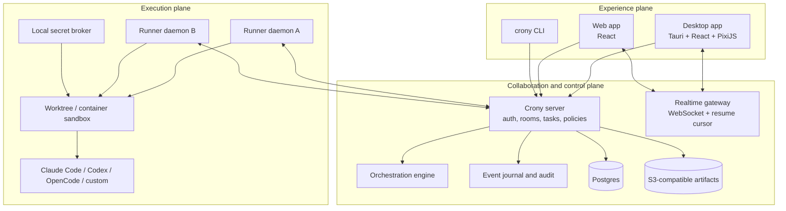

# Crony Corp

## Product and Technical Plan

**Working title:** Crony Corp  
**Research snapshot:** August 29, 2026  
**Recommendation:** Build a new greenfield repository. Do not fork either source project as the primary base.

### Repositories reviewed

- Munder Difflin: `chaitanyagiri/munder-difflin`
  - Local research checkout: `C:\Users\shyamsridhar\code\_research\munder-difflin`
  - Reviewed commit: `956bfb4cff1af97f9cf29b9ce489ae69a5774843`
- Buzz: `block/buzz`
  - Local research checkout: `C:\Users\shyamsridhar\code\_research\buzz3`
  - Reviewed commit: `00e61eafa917d296104006576b7a2ddbfd58bb5a`

### Implementation checkpoint — August 29, 2026

- The greenfield repository, ADR set, Postgres event journal, server, runner, CLI, and React client
  are operational.
- The multiplayer vertical slice has durable rooms, replay, fenced control leases, runner grace,
  reconciliation, and duplicate-delivery protection.
- The shared adapter contract and first real OpenAI Codex app-server adapter are implemented.
- Authenticated probes have validated live steer, interrupt, emergency stop, resume, usage, and
  evidence across the browser/server/runner/provider boundary.
- Per-task Git worktree isolation now provisions deterministic branches, reuses the exact worktree
  for resume, and preserves every dirty, committed, or uncertain result.
- Replaceable manager strategies now persist bounded task contracts and dependency graphs; the
  scheduler dispatches parallel roots, releases downstream tasks, and enforces retry limits.
- The next critical-path item is evidence-gated verification.

---

# 1. Executive recommendation

Crony Corp should be:

> **A multiplayer command center where humans and autonomous agents run a persistent company together.**

It should combine:

- Munder Difflin's delightful, legible office-floor experience, real terminal-agent adapters, worktrees, task board, memory, budgets, circuit breaker, and direct steering.
- Buzz's real multi-user collaboration, durable rooms and threads, identity, audit history, remote agents, workflows, presence, voice, and agent-first protocol surface.

It should **not** be a code merge of the two.

The source systems have incompatible architectural centers:

- Munder Difflin is a local desktop supervisor. Its Electron main process owns PTYs, coordination files, routing, integrations, schedules, and much of the application lifecycle.
- Buzz is a distributed collaboration relay. Its server, protocol, database, identity model, clients, workflows, media, git hosting, and agent harness form a much broader platform.

Forking either one would force Crony Corp to spend its first year undoing the assumptions of the chosen base. A greenfield design can preserve the best product ideas while creating the missing multiplayer and execution boundaries correctly.

## The product wedge

The market already contains capable coding-agent dashboards, worktree orchestrators, remote-control interfaces, and multi-provider harnesses. Crony Corp will not win as "another kanban for coding agents."

Its defensible wedge is the combination of:

1. **Multiplayer-first:** multiple humans and agents inhabit the same organization in real time.
2. **Persistent organizational state:** rooms, task graphs, decisions, artifacts, budgets, policies, and institutional memory survive every client and agent process.
3. **A real execution plane:** agents run in isolated workspaces on local or remote runner nodes.
4. **An inspectable world:** the office is a live projection of real events, not decorative animation.
5. **Open interoperability:** MCP for tools, ACP for compatible local agent clients, and A2A for remote or external agents.
6. **Verified outcomes:** the system measures artifacts, tests, approvals, and business outcomes rather than message volume or agent theatrics.

---

# 2. What the source projects teach us

## 2.1 Munder Difflin: what to retain

### Product strengths

- Real coding CLIs run in authentic PTYs.
- Multiple providers are normalized behind one visual experience.
- Each active agent has an avatar and a visible physical state.
- Tool activity is mapped to meaningful office stations.
- The operator can inspect terminals, steer, interrupt, queue work, and observe costs.
- Agents can be isolated in git worktrees.
- The hive includes memory, mailboxes, a blackboard, a task ledger, and an orchestrator.
- The Command Center makes abstract agent work tangible.
- The visual metaphor is memorable and demo-friendly.

### Technical ideas worth preserving

- Separate structured lifecycle events from raw terminal bytes.
- Prefer real provider lifecycle events over terminal-output scraping.
- Use explicit message acts such as request, inform, propose, and done.
- Make task dispatches self-contained:
  - objective
  - expected output
  - tools and references
  - boundaries and definition of done
- Include hop limits, idempotency, budgets, and circuit breakers.
- Treat per-agent worktree isolation as a first-class execution primitive.

## 2.2 Munder Difflin: what to replace

### Coordination storage

The local git repository and file mailboxes are clever for a prototype, but they are not a suitable multiplayer system of record.

Problems to avoid:

- Polling file outboxes introduces latency and wake-up ambiguity.
- A whole-tree `git add -A` can make audit commits contain unrelated changes.
- Git locks can stall coordination.
- The single desktop process is a failure and performance boundary.
- Files do not naturally provide leases, transactions, authorization, tenant isolation, or efficient multi-user queries.
- One co-edited blackboard requires a privileged single scribe.

**Crony decision:** use transactional state plus an immutable event journal. Git remains for source artifacts, not for the message bus.

### UI-owned process lifecycle

Munder's desktop main process owns too much. Closing, freezing, updating, or blocking the desktop application can affect active agents.

**Crony decision:** a separate runner daemon owns PTYs and agent processes. Desktop and web clients are replaceable views.

### Single GOD agent

A fixed god agent is easy to understand, but it becomes:

- a routing bottleneck
- a single model/provider dependency
- a single context window
- a single failure domain
- an implicit policy engine hidden inside a prompt

**Crony decision:** orchestration is a replaceable role and strategy. A workspace can use one manager, a hierarchy, a deterministic workflow, a peer swarm, or a review quorum.

### Human approval

Tool prompts inside one agent terminal are not a sufficient multiplayer approval system.

**Crony decision:** approvals are durable, typed records with:

- requested action
- risk classification
- requester
- required approver role
- expiry
- decision
- rationale
- linked run and artifact

## 2.3 Buzz: what to retain

### Product strengths

- Humans and agents occupy the same rooms and use the same collaboration primitives.
- Channels, threads, DMs, presence, reactions, canvases, workflows, search, and voice form a real workspace.
- The relay is a durable shared substrate rather than a bot integration.
- Agent identities and contribution histories are first class.
- Remote agents are part of the product model.
- Signed and auditable actions improve provenance.
- Branches as rooms is a powerful mental model.
- The agent-first CLI and protocol surfaces are stronger than GUI-only control.
- The project explicitly acknowledges current limitations instead of presenting roadmap ideas as shipped behavior.

### Technical ideas worth preserving

- One authoritative collaboration service.
- Append-only event history with materialized views.
- Strong tenant and room boundaries.
- Agent and human actors represented in the same domain model.
- Per-actor identity rather than one shared bot credential.
- Outbound runner connections for remote execution.
- Explicit event correlation, subscriptions, and replay.
- Auditability at the boundary.

## 2.4 Buzz: what to simplify or replace

### Mandatory Nostr semantics

Nostr supplies signed events and portable identity, but it also introduces:

- key-management and recovery friction
- event-kind design overhead
- protocol concepts unfamiliar to mainstream teams
- temptation to model every application operation as one generic event shape

Buzz's own product documents acknowledge key-management and onboarding costs.

**Crony decision:**

- Human identity uses OIDC and passkeys.
- Agents and runners receive independent cryptographic identities.
- High-value actions are signed and every state transition is audited.
- A Nostr bridge can be added later; Nostr is not the mandatory internal model.

### Platform breadth

Buzz includes collaboration, workflows, mobile clients, media, voice, git hosting, search, moderation, federation concepts, and shared compute.

**Crony decision:** do not build a full Slack, GitHub, Discord, CI system, and model network in the MVP. Integrate with existing repositories and providers first.

### Agent secret injection

Open Buzz issues and the reviewed code show that long-lived agent credentials can enter child-process environments and, through adapters, command-line arguments.

**Crony decision:** the agent model should not receive long-lived workspace credentials. Use a broker that exchanges short-lived capability tokens over a local authenticated channel.

### Workflow reliability

Open issue patterns include re-trigger cycles, duplicate replies, wake-up failures, and incomplete approval suspension.

**Crony decision:** idempotency, causal-depth limits, durable suspension, leases, and at-most-once effects are part of the first execution design, not later patches.

---

# 3. Product definition

## 3.1 The core object: a Corp

A **Corp** is a persistent multiplayer workspace containing:

- people
- agents
- runner machines
- departments
- rooms
- projects and repositories
- missions and task graphs
- conversations
- artifacts
- decisions and approvals
- memory
- budgets
- policies
- activity history

Every Corp has an office-floor representation, but the underlying state is usable through web, desktop, CLI, SDK, and APIs.

## 3.2 Actor types

| Actor | Description |
|---|---|
| Human | Owner, admin, manager, member, guest, or spectator |
| Agent identity | Persistent employee identity with role, owner, history, and capabilities |
| Agent instance | One running session of an agent identity on a runner |
| Service | CI, GitHub, Slack, webhook, scheduler, or another integration |
| Runner | Trusted execution node that starts and supervises agent processes |

An agent identity and an agent process are deliberately separate. A persistent agent can have many sessions over time without losing its history.

## 3.3 Primary user journeys

### Journey A: run a real project

1. Create a Corp.
2. Invite another human.
3. Connect a GitHub repository.
4. Connect one or more runner machines.
5. Hire agents with roles and provider adapters.
6. Create a mission.
7. A manager proposes a task graph.
8. Humans edit or approve the graph.
9. Workers claim isolated tasks and execute in worktrees.
10. Reviewers validate artifacts and tests.
11. A human approves the final integration.
12. The complete mission can be replayed from request to result.

### Journey B: multiplayer operations

1. Two humans join the same project room.
2. Both see agent presence and current activity.
3. One human holds the live steering lease for an agent.
4. The second human can queue a message, request control, or comment in the run thread.
5. An approval request appears to the correct role.
6. The decision immediately resumes or cancels the suspended run.

### Journey C: simulation mode

1. Start a sandbox Corp with a fixed budget and scenario.
2. Humans choose or design an org structure.
3. Agents negotiate, plan, delegate, and execute simulated business missions.
4. The system scores verified outcomes, cost, latency, safety, and collaboration.
5. Teams compare orchestration strategies through replay and metrics.

Simulation mode should reuse the same task, actor, event, and policy engine as real work.

---

# 4. What "multiplayer" must mean

Multiplayer is not merely several browser connections.

The MVP must support:

- simultaneous human presence
- rooms and threads
- shared task-board updates
- durable comments and decisions
- one explicit live controller per agent session
- queued messages from non-controlling users
- control handoff
- real-time run and terminal observation
- role-based approvals
- invitations and guests
- reconnect and replay from a sequence cursor
- clear attribution for every action

## Control-leasing rule

One actor owns an agent's interactive input lease at a time.

Other actors may:

- request the lease
- queue a message
- attach a comment to the active run
- ask the manager to re-plan
- issue an emergency stop if policy permits

This prevents two humans, an orchestrator, and an automation from typing contradictory instructions into the same session.

---

# 5. Product surfaces

## 5.1 Floor

The spatial view shows:

- humans and agents
- rooms mapped to projects or departments
- desks mapped to active agent instances
- stations mapped to real tool activity
- envelopes mapped to actual messages
- meeting rooms mapped to active voice or review sessions
- blockers and approvals
- agent health, budget, and current mission

The floor is a projection, never the authoritative state.

Every visual effect must communicate operational information. Spatial navigation cannot be required to complete a task.

## 5.2 Operations

- mission list
- dependency-aware task board
- current and historical runs
- agent roster
- runner-node health
- budgets and spend
- approvals
- incident and breaker feed
- artifact review

## 5.3 Rooms

- chat
- threads
- mentions
- files and artifacts
- task links
- run links
- decisions
- optional voice

## 5.4 Agent inspector

- live terminal
- current task contract
- current plan
- tool timeline
- context and memory sources
- current worktree
- changed files
- test evidence
- token and cost use
- permissions
- queue
- steer, interrupt, stop, or transfer-control actions

## 5.5 Replay

A sequence-based timeline reconstructs:

- who requested the work
- how it was decomposed
- which agents were assigned
- messages and handoffs
- tool calls
- artifacts
- approvals
- failures and retries
- final result

Replay is a core trust feature, not a post-launch analytics feature.

---

# 6. Architecture

## 6.1 Three-plane design

Crony Corp should extend Munder's two-plane idea into three strict planes.



### Invariant 1

The UI never owns the authoritative process lifecycle.

### Invariant 2

The runner never owns organizational state.

### Invariant 3

The server never directly executes untrusted agent shell commands.

## 6.2 Deployment topologies

### Development

- server
- Postgres
- MinIO
- one local runner
- web client

Run through one Docker Compose file plus a native runner.

### Team deployment

- one or more server instances
- managed Postgres
- S3-compatible object storage
- optional Redis or NATS for horizontal real-time fan-out
- any number of outbound-connected runner nodes

### Later solo mode

A bundled local server may use SQLite, but this should not delay the multiplayer architecture. Build team mode first.

## 6.3 Modular monolith first

Do not begin with many deployable microservices.

Start with:

- one server binary
- one runner binary
- one web application
- one desktop shell

Internally isolate modules with explicit interfaces. Split services only after measured load or trust-boundary requirements justify it.

---

# 7. Internal event and state model

## 7.1 Event envelope

```json
{
  "id": "01J...",
  "schema_version": 1,
  "corp_id": "corp_...",
  "room_id": "room_...",
  "actor_id": "actor_...",
  "type": "task.claimed",
  "aggregate_type": "task",
  "aggregate_id": "task_...",
  "aggregate_version": 8,
  "correlation_id": "mission_...",
  "causation_id": "event_...",
  "idempotency_key": "runner_...:attempt_...:claim",
  "visibility": "room",
  "payload": {},
  "created_at": "2026-08-29T00:00:00Z"
}
```

## 7.2 Storage strategy

Use a hybrid model:

- Relational tables are authoritative for configuration, membership, ACLs, current task state, leases, and budgets.
- Task and run lifecycle changes emit immutable domain events in the same transaction.
- A transactional outbox publishes committed events to WebSocket subscribers and background processors.
- Ephemeral cursor and typing presence is not written to the permanent journal.
- High-value approvals and artifacts carry cryptographic attestations.

This provides replay and audit without forcing every screen query through a pure event-sourcing projection.

## 7.3 Core aggregates

- Corp
- Actor
- Membership
- Department
- Room
- Project
- Repository
- Mission
- Task
- Run
- Agent identity
- Agent instance
- Runner node
- Message thread
- Artifact
- Decision
- Approval
- Budget
- Policy
- Memory item

## 7.4 Task state machine

```text
draft
  -> ready
  -> claimed
  -> running
  -> blocked
  -> awaiting_approval
  -> review
  -> completed

Any active state:
  -> failed
  -> cancelled
  -> expired
```

Every transition uses:

- expected aggregate version
- idempotency key
- actor authorization
- optional lease fencing token

## 7.5 Run state machine

```text
provisioning -> starting -> running
running -> waiting_for_input
running -> waiting_for_approval
running -> verifying
running -> completed
running -> failed
running -> cancelled
running -> lost
```

A disconnected runner does not immediately mean a failed run. It enters a grace period and reconciles by run ID and fencing token.

---

# 8. Agent runtime and adapters

## 8.1 Runner daemon

The runner:

- registers itself with the Corp
- advertises OS, capacity, installed adapters, and sandbox features
- receives leased run assignments
- creates workspaces or worktrees
- starts agent processes
- streams terminal bytes and structured events
- enforces budgets and timeouts
- brokers scoped tools and secrets
- uploads artifacts
- reconciles after restart

## 8.2 Adapter interface

```rust
trait AgentAdapter {
    fn capabilities(&self) -> AdapterCapabilities;
    async fn spawn(&self, request: SpawnRequest) -> Result<Session>;
    async fn send(&self, session: &Session, input: AgentInput) -> Result<()>;
    async fn interrupt(&self, session: &Session) -> Result<()>;
    async fn stop(&self, session: &Session) -> Result<()>;
    async fn resume(&self, request: ResumeRequest) -> Result<Session>;
    async fn stream_events(&self, session: &Session) -> Result<EventStream>;
    async fn collect_usage(&self, session: &Session) -> Result<Usage>;
}
```

## 8.3 Adapter order

1. Native protocol adapter
2. ACP adapter
3. Provider SDK adapter
4. PTY adapter
5. Terminal-output parsing only as a degraded fallback

Initial adapters:

- OpenAI Codex — implemented with the native app-server JSON-RPC protocol
- Claude Code
- OpenCode

Add Gemini, Copilot, Cursor, and others after the lifecycle contract is stable.

## 8.4 Isolation

Baseline:

- one git worktree per write-capable task
- path-scoped filesystem access
- process-group cleanup
- CPU, memory, time, and token limits
- explicit network policy
- output size bounds

Higher-assurance mode:

- Docker or Podman container
- isolated user and process namespace
- read-only base image
- mounted worktree
- brokered network destinations
- no host secret environment

---

# 9. Protocol strategy

Crony should use protocols at clear boundaries rather than forcing one protocol to model everything.

| Boundary | Protocol |
|---|---|
| Agent to tools and context | MCP |
| Compatible client/editor to local agent | ACP |
| Remote or independently hosted agent to Crony | A2A |
| Browser and desktop real-time state | Crony WebSocket protocol |
| Human and service APIs | REST/JSON initially |
| Runner control | Authenticated bidirectional stream |
| Optional Buzz interoperability | Nostr bridge later |

## Rule

Crony's internal mission, task, approval, budget, and control-lease semantics remain Crony domain concepts. External protocols are adapters, not the core database schema.

---

# 10. Orchestration

## 10.1 Replace the single god with strategies

Supported strategy interface:

```text
plan(mission, available_agents, constraints) -> task_graph
assign(task, candidates, budget) -> assignment
react(event, graph_state) -> commands
review(artifact, evidence) -> decision
```

Initial strategies:

1. **Manager**
   - One lead agent plans and delegates.
2. **Manager plus reviewer**
   - Lead delegates; independent reviewer verifies.
3. **Parallel specialists**
   - Independent workers produce alternatives; a synthesizer chooses.
4. **Deterministic workflow**
   - No LLM routing; fixed task graph and conditions.

Later:

- hierarchical departments
- agent bidding
- consensus or quorum
- adversarial review
- tournament policies

## 10.2 Task contract

Every assigned task contains:

- objective
- expected deliverable
- acceptance tests
- allowed tools
- prohibited actions
- references
- write scope
- budget
- deadline
- escalation path

An agent should not need to infer hidden requirements from a manager's conversation history.

## 10.3 Scheduling

The scheduler uses:

- capability matching
- workspace locality
- model/provider availability
- estimated cost
- queue depth
- prior task performance
- human preference
- concurrency limits

Every assignment has:

- lease
- heartbeat
- fencing token
- retry policy
- maximum attempts
- dead-letter state

## 10.4 Cycle and runaway controls

- maximum causal depth
- maximum task-generation depth
- maximum replies per conversation
- maximum consecutive identical tool fingerprints
- workflow self-trigger detection
- per-run and per-mission cost limits
- no-progress deadline
- explicit exception for healthy human conversation
- steer, constrain, suspend, stop escalation ladder

## 10.5 Verification

Completion is not an agent saying "done."

Each task can require:

- file existence
- structured artifact schema
- unit tests
- browser test
- static analysis
- build
- screenshot
- human approval
- independent model review
- external API confirmation

The task only completes after its verifier policy passes.

---

# 11. Memory and knowledge

## 11.1 Memory tiers

| Tier | Purpose |
|---|---|
| Working context | Current task and active thread |
| Episodic | Completed runs, failures, decisions, and outcomes |
| Semantic | Documents, code, artifacts, and indexed knowledge |
| Organizational | Policies, standards, role definitions, approved strategy |

## 11.2 Memory record

Every memory item includes:

- scope: private, agent, room, project, or Corp
- source event and artifact IDs
- author
- creation time
- confidence
- expiry or review date
- sensitivity
- access policy
- supersedes relationship

## 11.3 Admission control

Agents may propose memory. They do not silently promote arbitrary text into permanent organizational truth.

Policies can require:

- source-backed memory
- human approval
- reviewer approval
- automatic expiry
- contradiction checks

## 11.4 Retrieval

Start with:

- Postgres full-text search
- metadata and ACL filtering
- recency and source quality

Add embeddings only after a retrieval evaluation shows a material benefit.

Every prompt should record which memory items were retrieved so incorrect behavior can be traced to its context.

---

# 12. Identity, authorization, and secrets

## 12.1 Human identity

- OIDC
- passkeys where supported
- recovery flow
- optional enterprise SSO later

## 12.2 Agent identity

Each agent has:

- independent Ed25519 keypair
- owner or sponsor
- role
- capability grants
- expiry and revocation
- history

The owner's identity is never shared with the agent.

## 12.3 Runner identity

- device enrollment
- short-lived certificates
- outbound connection only
- revocation
- later SPIFFE-compatible workload identity

## 12.4 Authorization

Use role plus capability checks:

- human workspace role
- room/project membership
- agent grants
- task-specific capability token
- resource scope
- action risk class

## 12.5 Secret broker

Rules:

- no long-lived secrets in prompts
- no long-lived workspace credential in agent-readable files
- avoid secrets in environment variables and command-line arguments
- short-lived scoped credentials
- secret references in task definitions
- broker access audited
- values redacted before UI, logs, traces, and memory

If an external CLI only supports environment credentials, run it in an isolated process or container and classify the adapter as reduced-assurance.

---

# 13. Multiplayer state and conflict handling

Use different consistency models for different data.

| Data | Consistency |
|---|---|
| Task state, approvals, budgets, leases | Transactional and authoritative |
| Chat and run events | Ordered per room or aggregate |
| Presence, cursor, typing | Ephemeral eventual consistency |
| Shared documents and whiteboards | CRDT |
| Terminal bytes | Ordered stream with bounded replay |
| Office layout preferences | Last-writer-wins or CRDT |

Automerge or Yjs can support collaborative documents. Do not use CRDTs for approvals, budget debits, task claims, or control leases.

---

# 14. Recommended technology stack

## Backend and runner

- Rust
- Tokio
- Axum
- SQLx
- Postgres
- `portable-pty` or a comparable cross-platform PTY layer
- S3-compatible artifact storage
- OpenTelemetry

## Frontend

- React
- TypeScript
- Vite
- PixiJS for the office floor
- standard DOM/SVG for dense operational views
- TanStack Query
- Zustand only for local interaction state

## Desktop

- Tauri 2
- thin shell over the same web application
- no authoritative state in the Tauri process

## Testing

- Rust unit and integration tests
- Vitest
- Playwright
- deterministic fake-agent adapter
- Docker Compose end-to-end environment
- chaos tests for runner disconnect, duplicate delivery, server restart, and lease expiry

## What not to add initially

- Kafka
- Kubernetes requirement
- custom vector database
- built-in git hosting
- native mobile clients
- full federation
- multiple deployable backend microservices
- a mandatory blockchain or cryptocurrency layer

---

# 15. Repository structure

```text
crony-corp/
  README.md
  LICENSE
  NOTICE
  AGENTS.md
  Cargo.toml
  package.json
  pnpm-workspace.yaml

  apps/
    web/
    desktop/
    admin/

  crates/
    crony-domain/       # pure types, state machines, policy interfaces
    crony-protocol/     # event envelopes, schemas, generated bindings
    crony-store/        # Postgres repositories and transactional outbox
    crony-server/       # HTTP, WebSocket, auth, orchestration host
    crony-runner/       # PTY, sandbox, worktree, process supervision
    crony-cli/          # human and agent CLI
    crony-mcp/          # MCP server for Crony tools/context
    crony-acp/          # ACP adapter
    crony-a2a/          # A2A gateway

  packages/
    protocol-ts/
    ui/
    floor/
    client-sdk/

  db/
    migrations/
    fixtures/

  deploy/
    compose/
    helm/               # later

  docs/
    PRODUCT.md
    ARCHITECTURE.md
    PROTOCOL.md
    SECURITY.md
    THREAT_MODEL.md
    EVALS.md
    OPERATIONS.md
    adr/
      0001-greenfield-modular-monolith.md
      0002-three-plane-architecture.md
      0003-event-and-state-model.md
      0004-agent-runner-boundary.md
      0005-identity-and-secret-broker.md
      0006-protocol-boundaries.md
      0007-office-is-a-projection.md
      0008-license-and-provenance.md

  tests/
    scenarios/
    evals/
    chaos/
    fixtures/
```

---

# 16. MVP scope

## MVP promise

> Two or more people can connect to the same Corp, launch several real coding agents on one or more runner machines, delegate a mission, watch and steer the work together, approve risky actions, and replay a durable record of the result.

## Must ship

- Corp creation and invitations
- human authentication
- rooms and threaded messages
- runner enrollment
- three agent adapters
- agent roster and instances
- one project and repository connection
- worktree isolation
- missions and dependency task graphs
- manager and manager-plus-reviewer strategies
- task leases and retries
- live terminal observation
- control lease and queued messages
- approvals
- budgets and breaker
- artifacts and evidence
- office floor
- operations dashboard
- event replay
- audit log
- CLI and MCP surface
- OTel traces

## Explicitly defer

- mobile apps
- built-in git hosting
- public federation
- full voice huddles
- external agent marketplace
- agent economy or tokens
- advanced reputation network
- dozens of providers
- custom emoji and culture suite
- autonomous production deployment

---

# 17. Delivery plan

Assumption: one primary developer using coding agents, with periodic design and security review.

## Phase 0: foundation decisions — week 1

Deliver:

- repository initialized
- license and provenance policy
- product spec
- architecture and threat model
- eight ADRs
- CI skeleton
- local Docker Compose
- fake-agent simulator

Exit criteria:

- one command starts Postgres, server, web, and fake runner
- a fake actor can emit a run event and the web client receives it

## Phase 1: authoritative vertical slice — weeks 2–4

Deliver:

- auth and Corp membership
- rooms
- event journal and resume cursor
- runner enrollment
- run leases
- one PTY adapter
- live terminal stream
- minimal floor with real state

Demo:

1. Two browsers join.
2. One user starts an agent.
3. Both see the same avatar and terminal.
4. One user holds control.
5. The other queues a message.
6. The UI closes and reopens without killing the agent.

## Phase 2: task graph and isolation — weeks 5–7

Deliver:

- missions
- task dependencies
- manager orchestration
- worktrees
- artifacts
- test evidence
- retries and dead letters
- budgets
- circuit breaker

Demo:

- manager decomposes one real repository change into parallel tasks
- workers operate in separate worktrees
- reviewer validates the result

## Phase 3: multiplayer control and approvals — weeks 8–10

Deliver:

- control leasing and transfer
- durable approval suspension and resume
- role-based policies
- shared comments and decisions
- reconnect reconciliation
- runner-loss handling

Demo:

- a destructive command suspends
- an authorized human approves from a second device
- the same run resumes once

## Phase 4: memory, replay, and trust — weeks 11–12

Deliver:

- source-backed memory items
- retrieval logging
- run replay
- audit viewer
- secret broker
- security regression suite

## Phase 5: dogfood alpha — weeks 13–16

Deliver:

- Windows, macOS, and Linux runner validation
- signed desktop builds
- onboarding
- error diagnostics
- three real dogfood teams
- 100-scenario evaluation set
- performance and reliability report

---

# 18. Evaluation plan

## 18.1 Deterministic system tests

- duplicate event delivery
- duplicate task claim
- stale fencing token
- runner reconnect
- server restart during tool call
- client disconnect during approval
- workflow self-trigger
- agent ping-pong
- budget exhaustion
- queued human messages
- two humans requesting control
- worktree conflict
- missing provider CLI
- path with spaces on Windows
- process tree cleanup
- secret-redaction failure
- cross-Corp access attempt

## 18.2 Agent behavior evaluations

Create at least 100 scenarios across:

- task decomposition
- capability matching
- delegation clarity
- cross-agent information requests
- reviewer disagreement
- escalation quality
- memory retrieval
- memory poisoning resistance
- refusal and policy compliance
- context compression
- recovery after failed tools
- cost-aware model selection

## 18.3 Outcome metrics

- task success rate
- verified completion rate
- human rework rate
- human intervention rate
- duplicate side-effect rate
- average cost per accepted artifact
- time to first useful artifact
- p95 message and presence latency
- run recovery rate after disconnect
- percentage of actions with complete provenance
- setup success by OS

## Initial targets

- less than 5 minutes from install to first running agent
- less than 500 ms p95 room-event delivery on one region
- zero duplicate irreversible effects in the chaos suite
- more than 90% run recovery after simulated client disconnect
- every completed task linked to evidence
- every secret access linked to actor, task, and policy

---

# 19. Security plan

Threat-model at least:

- malicious prompt or repository content
- compromised agent runtime
- malicious plugin or MCP server
- compromised runner
- malicious workspace member
- cross-Corp data leakage
- secret exfiltration
- path traversal and symlink escape
- command injection
- replayed approvals
- duplicate effects
- cost denial of service
- runaway recursive delegation
- poisoned memory
- forged artifacts

Required controls:

- tenant ID on every stored and authorized object
- authorization before subscription
- per-task capability tokens
- runner certificate rotation
- secret broker
- deny-by-default network policy in high-assurance mode
- immutable approval and audit events
- artifact hashes
- process and output limits
- plugin provenance and signatures
- security-focused end-to-end tests
- explicit deletion and retention policies

Use the OWASP Agentic AI threat taxonomy as a review checklist, not as a substitute for a system-specific threat model.

---

# 20. Licensing, assets, and name risk

## Source licensing

- Buzz is Apache-2.0.
- Munder Difflin source code is MIT.
- Munder's bundled LimeZu pixel-art assets are separately licensed and require attribution.
- The Office-inspired brand and cast should not be copied.

## Recommendation

- License Crony Corp under Apache-2.0.
- Maintain a `NOTICE` and third-party provenance ledger.
- Prefer a clean-room implementation of the architecture.
- Port individual code only after:
  - license review
  - source attribution
  - security review
  - tests proving it fits the new boundary
- Commission or generate original Crony Corp art.

## Name warning

"Crony" and "Crony Corp" are already in use by existing software and game-related entities. Treat Crony Corp as a working title until:

- trademark search
- domain review
- app-store search
- package-name search
- social-handle search

Possible fallback names:

- Crony HQ
- Orgcraft
- OfficeSwarm
- Boardroom OS
- Company of Agents

---

# 21. First end-to-end sample scenario

The first serious vertical slice should be:

## Mission

"Add a dark-mode preference to a sample React application."

## Participants

- Human owner
- Human reviewer on a second browser
- Manager agent
- Frontend worker
- Test worker
- Review agent

## Flow

1. Owner posts the mission in the project room.
2. Manager creates a three-task graph.
3. Owner approves the graph.
4. Frontend and test agents run in separate worktrees.
5. The floor shows real tool transitions.
6. Both humans observe live output.
7. Reviewer queues a clarification to the frontend agent.
8. The manager handles a dependency update.
9. A risky package command triggers an approval.
10. The second human approves it.
11. Review agent checks the diff and tests.
12. The system produces a merge-ready artifact.
13. Replay reconstructs the complete mission.
14. Closing the desktop app during the run does not stop any agent.

This scenario proves implementation, multiplayer delivery, agent coordination, human control, durability, and real user value in one flow.

---

# 22. Final product principles

1. **The office is a projection of truth.**
2. **The runner survives the UI.**
3. **Messages are not tasks; tasks have state machines.**
4. **An agent saying done is not evidence.**
5. **Every irreversible effect is idempotent and authorized.**
6. **Every agent has its own identity and blast radius.**
7. **Memory has provenance, scope, and expiry.**
8. **One manager is an option, not the architecture.**
9. **Multiplayer control conflicts are explicit.**
10. **Start with one coherent vertical slice, not an entire replacement for Slack, GitHub, and CI.**

---

# 23. Immediate next actions

1. Confirm Crony Corp is a working title.
2. Approve the greenfield/modular-monolith direction.
3. Create `C:\Users\shyamsridhar\code\crony-corp`.
4. Initialize the repository with the structure in section 15.
5. Add the eight ADRs before implementation.
6. Build the fake-agent vertical slice before any provider-specific adapter.
7. Implement the server-runner lease and event-resume path.
8. Add one real Codex or Claude Code adapter.
9. Demonstrate the two-browser control-leasing scenario.
10. Only then implement the full office artwork and additional providers.

---

# Research references

- Munder Difflin: https://github.com/chaitanyagiri/munder-difflin
- Buzz: https://github.com/block/buzz
- Model Context Protocol architecture: https://modelcontextprotocol.io/docs/learn/architecture
- Agent2Agent Protocol specification: https://a2a-protocol.org/latest/specification/
- Agent Client Protocol: https://github.com/agentclientprotocol/agent-client-protocol
- OpenAI Agents SDK multi-agent orchestration: https://openai.github.io/openai-agents-python/multi_agent/
- Anthropic multi-agent research system: https://www.anthropic.com/engineering/multi-agent-research-system
- Temporal durable execution: https://docs.temporal.io/
- Automerge local-first synchronization: https://automerge.org/docs/hello/
- OpenTelemetry traces: https://opentelemetry.io/docs/concepts/signals/traces/
- OWASP Agentic AI threats and mitigations: https://genai.owasp.org/resource/agentic-ai-threats-and-mitigations/
- Agent Orchestrator: https://github.com/Untrivial-ai/agent-orchestrator
- Omnigent: https://github.com/omnigent-ai/omnigent
- AWS Labs CLI Agent Orchestrator: https://github.com/awslabs/cli-agent-orchestrator
