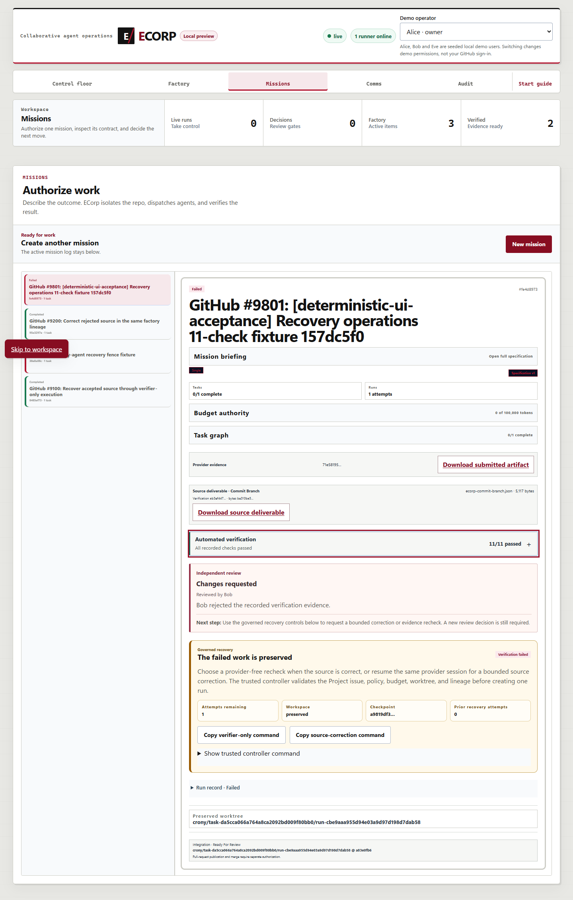
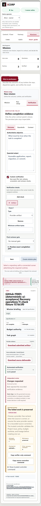

# Current-main recovery and operations acceptance

Collected September 6, 2026, America/Chicago; machine receipts use UTC and extend into
September 7 UTC. This is local systems evidence, not hosted Actions, real-model inference,
production human authentication, or external-team acceptance.

## Integration scope

The integration starts from `e76adf03185d2dd93b2761ecb5cf4ceee41a79e5`.
It preserves and reconciles PR #143 (`19f3ab43fabb95bf41912aa76a1505a37346d274`)
and the newer, uncommitted r148 repair rather than replacing either with an older branch.
The original dirty worktrees, failed recovery database, and artifact objects remain intact.

The unlanded recovery migration is **0037**, after main's staffing and polling migrations.
**0038** adds a durable `quarantined` workspace disposition. Existing migration bytes were
not changed. A real baseline binary initialized a separate database with 36 migrations;
candidate binaries upgraded owned databases through 38 with matching persisted checksums.

## Recovery corrections

- Verifier-only recovery hydrates the exact authorized, signed provider artifact over the
  runner channel. It enforces identity, digest, size, media type, retention, current role/room
  authority, and a 16 MiB ceiling. Bytes never enter durable commands or the preserved source.
- Every check uses a separate physical snapshot. Fingerprints bind filesystem modes as well
  as content; escaping links, reparse points, Git-control paths, and ambiguous paths fail closed.
- Source integrity is checked after upload acknowledgments and immediately before accepted
  verification, review waiting, or completion. A quarantined workspace cannot be reclassified
  as an unsealed legacy checkpoint by cleanup replay.
- Legacy checkpointing, recovery, resume, and publication reject quarantined source authority.
  Ordinary artifact errors may preserve the previously admitted fingerprint only when integrity
  still matches.
- Source correction after a verifier-only bridge resolves the existing provider session within
  the same Corp/task/agent/workspace. It does not assign a provider session to the verifier-only
  run or create an unrelated provider lineage.
- Repeated verifier-only generations retain the exact inherited artifact. Its producer need not
  be the immediate parent, but the authorized parent's artifact identity and scope must match.
- Recovery cannot take an agent already executing another mission. Explicit recovery reactivates
  its retired mission worker without deleting historical attribution.
- Reconnect reconciliation fences the connection epoch and gates dispatch. Pending, undispatched
  recovery commands are not mistaken for lost work. Authenticated heartbeats reconcile durable
  commands even when no UI request is active.
- Cached contract revisions bind the reviewed source and exact replacement contract/policy.
  Stale source, changed policy, wrong attribution, and obsolete versions cannot reuse a cached
  authorization.
- The development-only reset removes mission-owned crew after run/task references and before
  deleting their missions. This does not change normal, history-preserving retirement.

## Preserved-lineage systems drill

`tools/e2e_factory_verification_recovery.mjs` completed on an owned Windows server, PostgreSQL,
runner, and independent fixture repository, using deterministic fake-process and Codex protocol
fixtures. Its four cases retain earlier case state rather than resetting the demo:

| Case | Observed result |
| --- | --- |
| Rejected review → verifier-only | Same item, mission, workspace and head; two runs; zero provider events in recovery; keyed decision/controller replay |
| Failed file check → verifier bridge → correction | Signed artifact passes without a local copy; missing file still fails; revoked-secret dispatch terminalizes; authorized retry retains the original session/worktree and reaches verified |
| Cancellation | Active recovery slot released; stale review closed; another explicitly authorized recovery can use the preserved lineage |
| Repeated verifier failure | Original artifact verifies in both verifier-only generations; three attempts recorded and the fourth rejected |

The source-correction case also rejects an agent busy in another mission, proves worker
reactivation, rejects verifier weakening before a revision, restarts the actual server, and
retires a stale terminal command without re-execution.

The accepted drill's database was archived before unrelated controller/publication fixtures.
Earlier failures remain separate evidence, including rejection of a test that incorrectly
modified signed artifact metadata. No signature or integrity check was weakened to make it pass.

## Non-floor UI from #142

The current furnished office, studio staffing, and quota-aware Factory remain in place.
The older six-position floor and the 2,854-line Simple stylesheet were not restored.

- Automated checks default to a compact, keyboard-operable disclosure.
- **11/11 passed** remains distinct from **Changes requested** by an independent reviewer.
- Reviewer identity, bounded reason, full-findings disclosure, next action, and governed recovery
  controls remain separate and readable.
- Run metadata is compact; development identity help is visible and associated with the selector.
- The verifier editor, selected check tabs, warnings, and specification chips use readable light
  surfaces rather than the previous dark control blocks.

The browser fixture was created by the actual factory CLI and runner, not by injecting page
state. Its 11 checks include one clearly labeled proof-writing verifier and a deterministic
1,500 ms delay; this is test timing, not model performance.

Chrome exercised Bob's real UI rejection and verified the persisted decision. A read-only
continuation used that same rejected fixture for desktop/390px, keyboard disclosure, selected
verifier tabs, complete copied commands, light-surface contrast, and overflow checks. There were
no page/console errors or forbidden requests. The draft verifier editor was not submitted.
Long reviewer prose was not manufactured to exercise the optional full-findings disclosure.

390-pixel layout and light verifier editor

Bounded receipts: [recovery](assets/recovery-operations/recovery-result.json),
[browser](assets/recovery-operations/browser-result.json), and
[final light surfaces](assets/recovery-operations/light-surfaces.json).

## Reproduction and boundaries

- Run the workspace gates in `AGENTS.md`, including migration, format, Clippy, Rust, web build,
  and web lint checks.
- The recovery harness requires explicit owned endpoints, database, source and output paths;
  see `docs/EVALS.md`. It rejects shared/manual ports and the ECorp source checkout.
- `tools/owned_test_stack.mjs` requires an ownership manifest and verifies executable, PID creation
  time, and listener before a Windows test restart. Test credentials stay out of command arguments.
- `tools/e2e_recovery_operations_browser.mjs` consumes six existing fixture IDs. Its optional
  `ECORP_UI_RECOVERY_ALREADY_REJECTED=1` mode is a read-only continuation, not a second decision.
- The exact workspace module additionally passed 18 tests on a native Linux filesystem under
  Rust 1.94.1, including Unix mode drift, contained/escaping links, snapshot permissions, and
  source immutability. This is not a whole-application Unix-provider claim.

## Explicitly not completed

**#148 remains open.** Budget-boundary checkpoint recovery is not implemented by this work.
Suspend/stop provider lineages remain fenced; verification-failure recovery cannot bypass them.
The broader #144/#145 operating-lane work, complete crew-management controls in #48, shared
contributor authority in #161, and external-team evidence in #27 are not closed by these tests.

No hosted Actions were required. No production deployment or auto-merge is part of this evidence.

## September 7 pre-landing review checkpoint

The integration is a **draft, not approved for merge**. A fresh native serial Rust test run
(`RUST_TEST_THREADS=1 cargo test --workspace`) passed 312 tests. Migration, format, Clippy,
binary build, web build/lint, owned-stack tests, browser-script syntax and diff checks passed.
The default parallel Rust run instead hit seven process-fixture startup/notification timeouts;
the product deadlines and assertions were not relaxed.

The updated mission toolbar passed real Chrome checks at 1440 and 390 pixels: one action row,
44-pixel action targets, collapsed 11/11 evidence, separate rejected review, keyboard disclosure,
complete copied commands, and no horizontal overflow or console errors. The previous UI fixture
had already completed its offline recovery and was preserved. A separate, labeled deterministic
UI fixture supplied the new rejected state; its decision was executed once, followed by a
read-only continuation. A real reload, not a hash-only navigation, separates viewport cases.

Independent static review then identified remaining release work:

- Generic resume must not bypass the existing factory-recovery authorization boundary.
- Recovery completion must settle its own run even when downstream mission work remains.
- Lost verifier-only runs must not strand the active recovery slot.
- Live decision/factory events must be returned in sequence order.
- Stored artifact hydration must enforce its byte bound before collecting the entire object.
- Historical verification totals must not use a subsequently revised task policy.
- Contributor topology guidance must explicitly require the same Corp/claim namespace.

These findings are not waived by the passing tests. The previous publication regression failed
before its intended breaker assertion because its 30-second fixture lease had expired. The
fixture now requests a bounded 300-second initial authority-test lease and retains strict status,
error, and no-effect assertions; fresh full-stack publication acceptance is still required.
