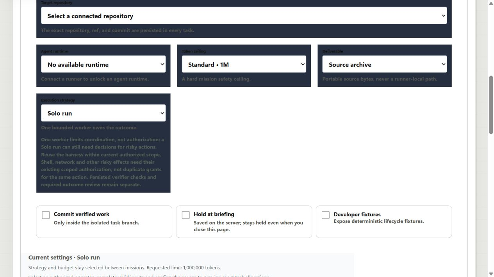
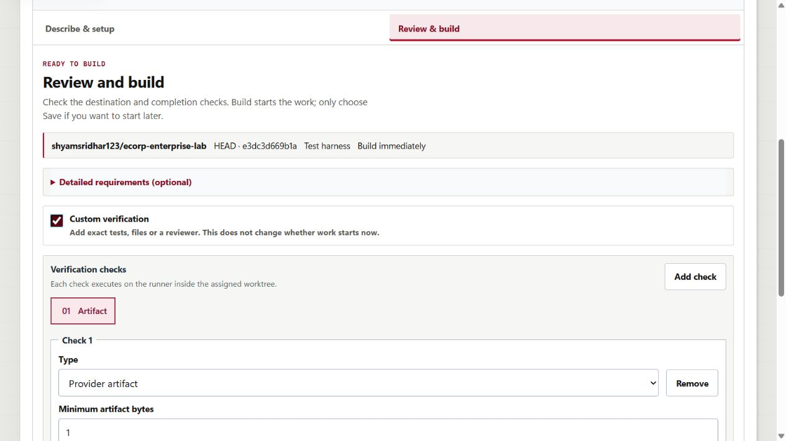
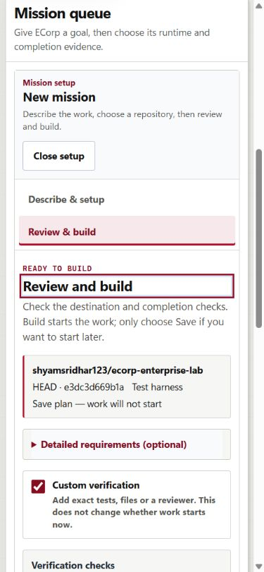

# ECorp build setup: clearer steps and explicit launch intent

Date: September 7, 2026, America/Chicago. Issue #173; parent journeys #145 and #164.
Source base: `eeb1dbdefe0e992970615854878683b64a4edb9e`.

## What changed

- **Describe & setup → Review & build.** Goal, repository and team are together;
  model, limits, output and detailed requirements are optional disclosures.
- Adding custom checks no longer silently enables a held plan. **Build** starts
  work; **Save plan** appears only after explicitly choosing **Save without starting**.
- Light form surfaces replace the unreadable dark configuration panels. Existing
  ECorp typography, accent and office artwork are retained.
- **Close setup** preserves the unsent draft on the current page and returns focus
  to **New mission**. Old mission evidence is not mixed into an open build form.
- Explicit links to existing work reveal the selected mission instead of leaving
  its draft in front of it. Draft contents are preserved.
- The ordinary composer excludes `fake-process`. Its **Test harness · no AI**
  option requires explicit **Developer fixtures** mode.

Native source confirmation, request/actor/Corp fencing, server-derived allocation,
budgets, write scope, verifier policy and the create/launch handler are preserved.
No new approval mechanism, permission bypass, watcher, service or container is added.

## Captured flow

### 1. Configuration before: poor readability

The original form combined near-black labels/help text with dark navy panels.
Turning on **Custom verification**, even with **No manual gate**, also silently
changed **Launch mission** into **Create mission plan**.

### 2. Review after: checks do not change launch intent

The corrected browser flow retained **Build** after adding checks. An explicitly
selected **Save plan** also stayed selected when checks were toggled off and on.
This screenshot uses an explicitly enabled deterministic developer fixture; it
is UI evidence, not an AI application-build claim.

### 3. Narrow view and existing-work navigation

At a 390-pixel viewport, both setup and review measured 375 CSS content pixels
with no horizontal overflow. Keyboard navigation focused the step heading with
a visible outline. Native disclosures operated with Enter.

Factory's **Open mission and results** was also exercised with a draft open.
After the correction it displayed exact mission
`d561cc2b-8d5e-44c9-b9da-ae6060af78b3` and its six original runs, with the composer
closed and its unsent draft preserved.

## Verification

- Full local gates passed: **358 Rust tests**, zero failures, 62 opt-in cases
  ignored; 38 immutable migrations; workspace formatting and all-target Clippy;
  frontend tests/build/lint and whitespace checks.
- That full run had **107 frontend tests**. A subsequent frontend-only navigation
  correction and its regression were rechecked separately: **108 frontend tests
  passed**, build/lint, both edited browser-helper syntax checks and diff checks
  passed. Backend, migration and dependency inputs were unchanged; no fresh
  post-correction Rust invocation is implied.
- The live browser verified explicit launch/save intent, keyboard disclosure
  operation, draft preservation, normal-mode fake-runtime exclusion, the actual
  read-only server allocation, and existing-work navigation.
- Sampled computed form text/background colors had a minimum contrast of
  **6.16:1**. This and the screenshots are not a full accessibility or screen-reader
  conformance claim.
- After correction, repeated green UI interactions changed no durable missions,
  tasks, runs, actors, agents, checks, reviews, approvals, deliverables or Factory
  records. The original accepted mission's history remained unchanged.

See the [source-hashed validation receipt](2026-09-07-build-setup-validation.json).

## Failures retained, not relabeled

An intermediate version reused a navigation button as a submit button during
its click. Browser testing exposed an unintended deterministic mission:
`f521956e-008b-416e-a1d6-f82530d134b5`, run
`000cd9a8-1dee-4c9e-8579-8ca8ae467261`, on `a-issue172-peer`.
It completed the fake-process artifact fixture—not a vendor application or an
AI model build. Its history and worktree were preserved.

Distinct navigation/submit keys and `preventDefault()` fixed that regression.
Subsequent mouse and keyboard navigation did not create work. The post-fix
retention baseline explicitly includes the diagnostic: **two missions/seven
runs**, not a fabricated return to one mission/six runs.

Independent source review additionally found that an open draft hid explicit
existing-work links. That case was reproduced and corrected; short re-review
reported no findings. The shared helper and Floor path are covered by a source
regression; the Factory path also has actual browser evidence.

A duplicated/stitched full-page screenshot was rejected from visual acceptance.
The report uses inspected viewport captures; the DOM contained one repository
control, not the duplicated content seen in that discarded capture.

## Remaining boundaries

No Build/Save action was intentionally submitted in the green UI acceptance,
and no new real-provider application build or exported-game preview is claimed.
The browser helpers' selectors were updated and syntax-checked; their complete
restart/provider suites were not rerun here. No merge, auto-merge, deployment or
hosted Actions success is claimed.

#172 remains incomplete. Its denied QA-bridge restart was not retried. The shared
QA fixture now also contains the preserved diagnostic above, so its old
whole-Corp one-mission/six-run assumptions are no longer current. Do not erase
that record or silently loosen a verifier to manufacture a pass. #145, #164 and
the broader dark-factory goal remain open beyond this scoped UI improvement.
