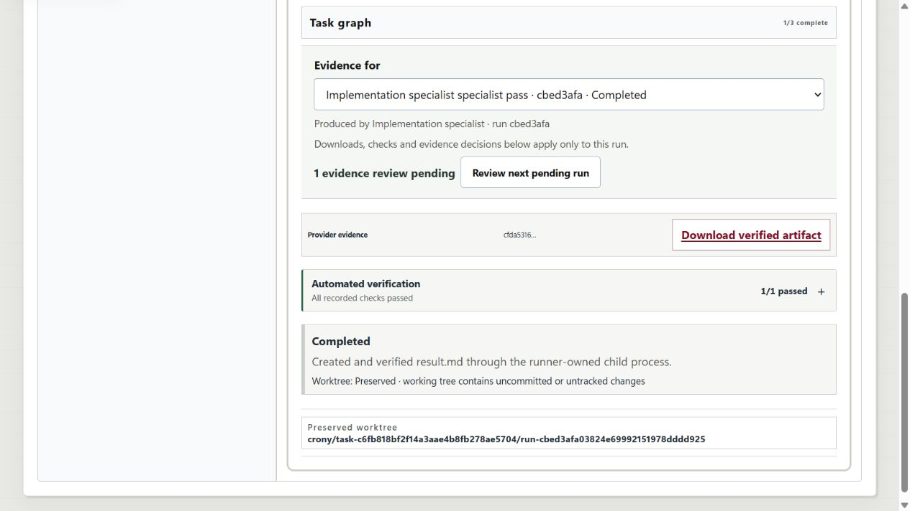
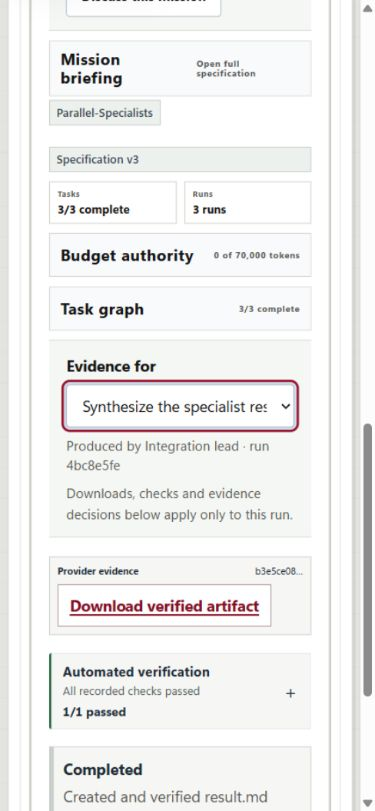

# ECorp evidence selection: two-review browser acceptance

**Date:** September 7, 2026

**Issue:** #163

**Delivery:** `codex/ui-enterprise-journey-audit`, draft PR #170, stacked on #162.

**Scope:** Local browser → server → runner → PostgreSQL acceptance with native
`fake-process` workers. This is not a real-provider or production-login claim.

## Result

Two retained three-task missions completed through the real ECorp stack. Each
mission had two independent root reviews and an automatically verified synthesis.
The browser's selected run, displayed evidence, artifact download and verification
decision referred to the same identity. A repeated keypress and real page reload
did not approve the other pending review. Only an explicit context switch enabled
its decision, and synthesis dispatched only after both roots were accepted.

The first pass found an additional defect: the in-memory selection survived a
snapshot refresh but not a page reload. The completed run was forgotten and the
remaining pending review became selected. No second approval was sent during
that failed observation. The failure, first decision and original mission were
preserved; the fix was exercised in place, then a fresh complete pass was run
entirely with the patched UI.

### Fix

- Remember the viewed run in tab-local session storage, scoped by API server,
  Corp, actor and mission. Store only a run ID, never a decision or authority.
- Pin the initially displayed run as well as explicit selections, decisions and
  native resume results.
- Resolve remembered IDs only against the current authorized mission snapshot.
  Missing, malformed or unreadable selection context cannot silently substitute
  another pending review; the compact selector remains available.
- Remount the review context when the Corp, actor or mission changes.
- Keep the existing verification endpoint and role/requester exclusions. No new
  approval system, per-artifact gate, provider loop or retry mechanism was added.

## Retained passes and exact ordering

| Pass | Mission | First decision | Second decision | Synthesis requested |
| --- | --- | ---: | ---: | ---: |
| Initial reproduction, correction and completion | `59b13205-087a-4d22-a4ce-32a195b151c1` | journal seq 41 | 46 | 47 |
| Fresh patched-UI / narrow-screen pass | `5d135468-1b00-4ae1-99ed-defa4f7698d9` | journal seq 100 | 102 | 103 |

The fresh pass used the first completed mission and its three runs as preserved
baseline objects. The helper compared their recorded row digests throughout;
none was reset, modified or replaced.

**First pass**

- Newer root: `cbed3afa-0382-4e69-9921-51978dddd925`.
- Older root: `4b83510a-04e4-414c-9afe-8f4b9154a022`.
- Synthesis: `4bc8e5fe-fe67-458a-b492-1e30116209f7`.

**Fresh pass**

- Newer root: `2db63278-6559-4f23-aee1-5f84e04d77e9`.
- Older root: `734f18f6-134a-46c3-85fd-2cfc9c0ca692`.
- Synthesis: `b3e16bd8-f057-4e45-ac14-ef95bbcde65d`.

Both helpers finished with `api_passed: true`: three completed tasks, three
preserved runs, one attempt per task, exactly two accepted review records, no
synthesis review, and synthesis content referencing both exact verified parents.

## Browser checks

- CUA operated the actual run selector, download and decision controls.
- Network observations recorded the exact `/runs/<selected-run>/verification-decision`
  POST, development Bob's actor ID, approval value and HTTP success.
- After the first decision, the same completed run remained selected, its
  decision buttons disappeared, and the other run remained pending.
- Repeated Enter and reload produced no further verification-decision POST.
  The API-only helper independently checked the journal and pending review before
  the second decision.
- The fresh pass measured **375 CSS content pixels in a configured 390-pixel
  viewport**, before and after both approvals. The second decision used keyboard
  selection, Tab navigation and Enter. A newer synthesis run appeared while the
  explicitly selected older run remained displayed.
- Alice's independent-review buttons remained disabled with an explanation.
  Eve saw no room-scoped mission or evidence. Returning to Bob restored his
  selection rather than inheriting Alice's different selected run.
- The final UI showed three of three tasks completed, no remaining decisions,
  and access to each completed run through the same compact selector.

The first pass's actual browser-saved downloads were independently hashed:

| Artifact | Bytes | SHA-256 |
| --- | ---: | --- |
| `ec90f8d6-0840-4a23-b9a2-cfec6a6f02e5` | 1,654 | `cfda5316131b5291c1230b31fce45f77fe405e2605556fd552446038e034bbe7` |
| `d9279c34-1ee5-450a-874f-fcee952f1ade` | 1,642 | `6278425ecf1ea7b30f10480a10ac50a9bf50e98f84bcd4195afb4306eba4eeba` |

Their browser request URIs, response signatures and byte lengths matched the
selected persisted evidence. One CUA download-event wait timed out and CDP body
retrieval returned empty; neither was treated as successful file verification.
The actual saved files were subsequently found and their complete bytes checked.

## Fixture ownership and reproducibility

Local receipt/evidence root:
`C:\Users\shyamsridhar\.codex\dogfood\issue163-acceptance-20260907`.

- API `127.0.0.1:18961`; UI `127.0.0.1:15496`.
- Dedicated database `crony_issue163_20260907`, using the already-running,
  approved PostgreSQL container on loopback port `54441`. No new container.
- Independent source commit `4112c0c53b54b42643d6ba75bb436f0db9fa5309`;
  fixture source, runner workspaces and evidence are outside the ECorp checkout.
- Native runner `issue163-evidence-fake`; all four real-provider capabilities
  were unavailable. Bootstrap used `seed_crew=false`.
- Frozen server SHA-256:
  `4a767b643c01c29e149a3f18edfcd8fdafa5e540595b315683d3ea605c7bb26d`.
- Existing manual ports `18962`/`15491`, real runners and completed application
  outcomes were not reset or restarted for this regression.

`fixture.json` / `checkpoint.json` retain the first pass.
`fixture-390.json` / `checkpoint-390.json` retain the fresh pass.
Each used `tools/e2e_evidence_selection.mjs` in this order:

1. `--phase prepare`.
2. Actual CUA approval of the recorded newer run.
3. `--phase verify-first`.
4. Actual repeated-key/reload exercise, without approving the older run.
5. `--phase verify-first --after-replay`.
6. Explicit CUA selection and approval of the older run.
7. `--phase verify`.

The helper never submitted either decision. It used native planning, held
missions, contract revisions, staffing, launch and artifact/snapshot reads.

## Local validation and limits

- Frontend suite: **99 passed**.
- Evidence helper: syntax check and **14 offline tests passed**, in addition to
  the two actual-stack passes above.
- Parent Rust workspace suite: **342 passed, 33 opt-in database tests ignored**.
  The separate #169 loader ran its 23 database cases successfully.
- Migration checks (38 immutable migrations), workspace format, all-target
  Clippy with warnings denied, web production build and lint: passed.
- The [source-hashed local validation receipt](2026-09-07-issue163-169-local-validation.json)
  records commands, retained log hashes, both passes and cleanup.
- No GitHub Actions credit, merge, auto-merge, deployment or application-source
  publication is claimed.
- These fixed development principals are not two authenticated GitHub users.
  No real model or game was run by this regression.
- The separate missing/delayed-ack runtime acceptance for #169 and fresh
  concurrent-provider load acceptance for #168 remain open.

After acceptance, the supervisor verified executable paths and exact process
birth times, then stopped only the owned QA UI, runner and server. Their system
console hosts exited automatically. Ports `15496` and `18961` were released; the
temporary QA tab was closed and viewport/diagnostic overrides were cleared.
Both fixture databases, object files, six preserved worktrees and all evidence
were retained. The manual listeners were unchanged, and a fresh read still
showed Incident Arcade completed with its Factory item verified.
