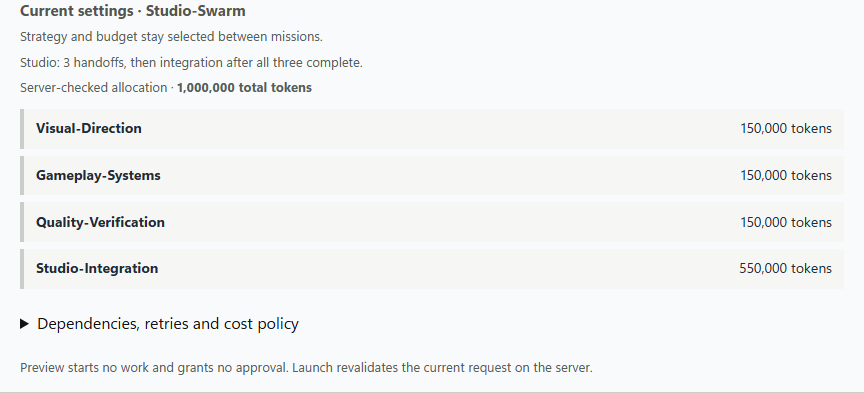
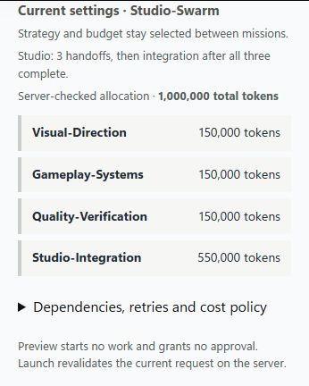

# Manual mission preview and Copilot directory consistency

**Status:** implemented and locally verified for issue #164. This is not a new completed
game, a production-authentication claim, or approval to merge PR #162.

## Reproduced failure

The manual brick-breaker mission `7af6b157-4a58-4ce0-98e2-7ed7ab5a5bbf` used Studio
against the separate `shyamsridhar123/ecorp-arcade-lab` repository. A 1,000,000-token
mission budget became three 150,000-token handoff allocations and a 550,000-token
integration allocation. The launch form did not expose that split.

The three specialists consumed 492,741 recorded tokens across 27 usage events while
writing, rereading and trimming their handoffs. Two runs reached a hard stop; the third
was suspended and the mission ended cancelled before integration. Two directory-tool
calls also rejected the exact worktree-absolute path before accepting its relative form.
These observations do not establish a billing amount or duplicate usage accounting.

## Changes

- `POST /api/corps/{corp_id}/missions/preview` reuses creation's authorization, request
  mapping, planner, source/model/verifier validation, and store admission checks.
  It returns task budgets, dependencies and attempt limits without persisting workers,
  missions, tasks, runs or events.
- Preview and submission use one serialized request body. Changes to the request, actor
  or Corp invalidate prior results; cancellation, timeout and unavailable-endpoint
  states never invent an allocation. Preview grants no execution authority.
- The form displays exact server allocations before the existing Launch action.
  Secondary dependency, retry and reported-cost policy details are keyboard-operable
  disclosures. Recorded-cost policy is explicitly not a provider billing estimate.
- Small Studio handoffs now have a concise decisions-first target. The existing runner
  still enforces UTF-8, byte length and artifact checks; their policies, budgets, write
  scopes and dependency gates were not weakened.
- `ecorp_mkdir` accepts contained absolute worktree paths through the existing native
  filesystem boundary. It gains no state-directory, root, Git-internal, symlink,
  out-of-scope, shell, deletion or chmod authority.

390-pixel layout

## Observed validation

The [bounded receipt](assets/mission-preview/validation.json) includes code/CSS hashes,
commands and source-state comparisons.

| Check | Result |
| --- | --- |
| Immutable migrations, format, workspace Clippy | Passed; 38 migrations |
| `cargo test --workspace` | 333 passed with native `RUST_TEST_THREADS=2` |
| Native Copilot filesystem/path subset | 22 passed; included in the workspace suite |
| Web build and lint | Passed |
| Preview unit tests | 18 passed |
| Combined frontend/runtime/office/owned-stack regressions | 104 passed; includes the 18 preview tests |
| Read-only API drill | 29 checks / 62 requests; visible rows and event watermark unchanged |
| Chrome at 1440 and 390 pixels | Exact Studio allocations, changed budget, actor change, keyboard disclosure, no overflow or console errors |

The handoff-guidance regression first failed against the old prompt and passed after the
change. An earlier browser attempt incorrectly reused a hash-only navigation between
viewports; that failed test evidence was retained, and the corrected check performs a
fresh document navigation. No product assertion or timeout was relaxed.

The API drill runs only against an explicitly supplied existing QA server, Corp and
operator. It creates no fixture identities or work. The Studio case additionally requires
`CRONY_PREVIEW_COPILOT_FIXTURE=1` and an already configured Copilot fixture capability.
There was no existing roomless operator, so that live denial case remains unexercised;
production OIDC was not tested.

## Resource and completion boundaries

One retained QA database was reused, not recreated. Its server, runner, browser and
database container were stopped after acceptance; its data and prior recovery fixtures
remain intact. No database or worktree was reset or deleted.

The manual instance was not promoted or restarted. Its original mission remains
cancelled with three preserved worktrees and the same 492,741 recorded tokens. No new
real-provider build was launched. A separately authorized real-provider run is still
required to prove that the improved handoff path reaches a completed playable game.

Budget-boundary checkpoint recovery in #148 remains separate. The original recovery and
publication failures received [subsequent verified fixes](2026-09-07-recovery-publication-runtime-fixes.md),
followed by the [pre-dispatch state repair](2026-09-07-predispatch-state-coherence.md).
Those checks do not constitute a new real-provider game build. No hosted Actions,
merge, auto-merge or deployment is claimed here.
