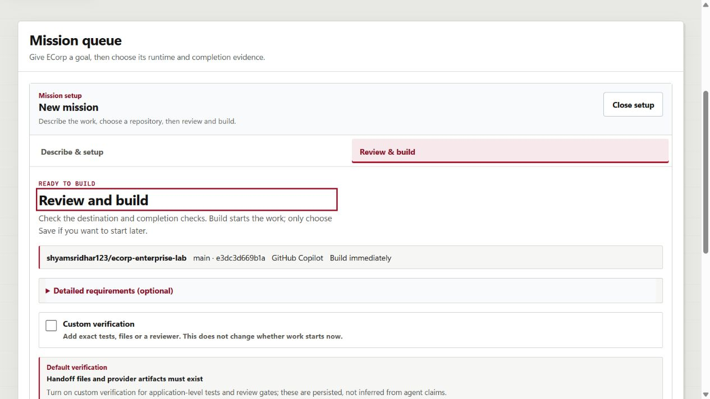

# ECorp normal runtime restored after Windows update

Date: September 7, 2026, America/Chicago. Related: #145, #173, #174.

## Restored, not replaced with another test environment

The normal manual API/UI were offline after the user's Windows reboot. They now
run at their existing loopback addresses, **18962 / 15491**, with product code
`034abd3899ff85530b11f7ba23b6d9fba6f05089`.

- Reused the existing PostgreSQL container, database, source checkouts, object
  store, workspaces and rotating runner credentials. No new database/container
  or runner enrollment.
- Both existing real GitHub Copilot runners reconnected: the Arcade Lab runner
  and the Enterprise Lab runner. Their advertised source commits match the
  retained clean checkouts; the enabled `gpt-5.6-sol` model was checked live.
- The Enterprise runner's original provider home was identified by all four
  existing workspace hashes and reused. This is path preservation, not a new
  vendor-session-resume test.
- The existing Factory worker is healthy. Its **paused** desired state and exact
  Enterprise Lab issue/policy scope were preserved; intake was not enabled.
- A reused pre-reboot web PID belonged to an unrelated process and was not
  stopped. Old ownership records/logs were retained before updating the launcher.

This normal stack uses direct runner connections. It does **not** use or replace
the separate ACK-fault QA bridge on port 18963.

## Observed browser and data proof

The normal UI shows **two runners online** and all **three completed missions**:
the brick-breaker, VendorDesk, and Incident Arcade. All **16 run records** remain.
All **15 source-deliverable downloads** passed their stored SHA-256, byte-length
and provenance-signature-header checks. No downloaded game was executed.

The real-Copilot Enterprise Studio preview showed the server-derived allocation:
150,000 tokens for each of three specialists, followed by 550,000 for integration.
**Build was enabled, but not clicked.** The owned readiness-only draft was cleared.
Subsequent snapshots proved this browser check changed no saved mission, task,
run, verification, approval, deliverable or Factory work-item records.

The Factory screen displays **Paused**, a current heartbeat, and its existing
**Resume intake** / **Reconcile now** controls. This is not a “watching and
automatically building” claim.

See the [runtime receipt](2026-09-07-normal-runtime-restoration.json) for exact
source, process, artifact and state fingerprints.

## Limits and remaining work

- This proves restoration and planning readiness, not a fresh application build.
  Previously completed applications are not relabeled as new outcomes.
- The separate VendorDesk app preview at port 15501 was **not restored**: the
  tool policy rejected its startup command before execution. No alternate
  hosting/transport path was attempted.
- Incident Arcade was not executed or previewed. #172's denied QA-bridge restart
  and its pending acceptance remain separate and unresolved.
- Development principals/default development keys remain development-only.
  No production authentication or deployment claim is made.
- Exact previously tested source/binary identities were reused; repository
  tests were not falsely claimed as rerun for this operational restoration.
- A stale Arcade controller record was rejected before startup; the actual
  persisted Enterprise configuration was then restored. An initial readback
  probe assumed all rows had `id`; it was corrected to fingerprint full row JSON
  because verification requests use `run_id`. No runtime rows were edited.

The public local-start helpers still need reboot-safe idempotence, identity
verification, credential/log reuse, environment-only database credential delivery,
and one configured address pair. Those verified source gaps are tracked in
**#174**, not a new local Markdown backlog. No merge or auto-merge was performed.
