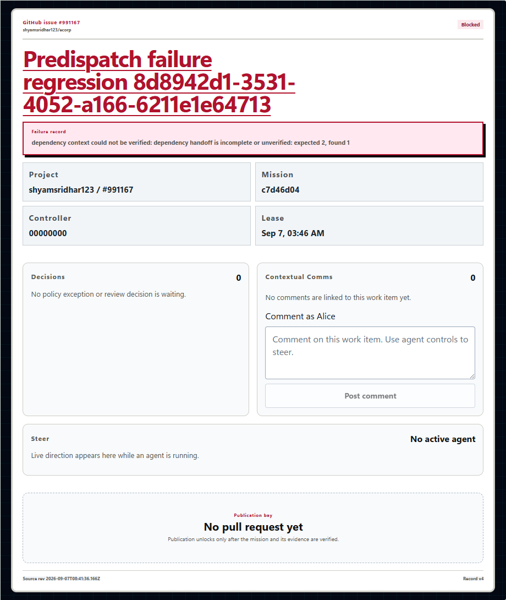
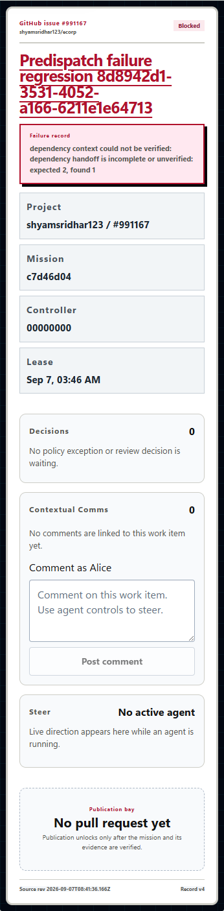

# Pre-dispatch failure state coherence

**Issue:** #167. A missing or invalid dependency handoff previously failed a run, task
and mission while leaving the factory item misleadingly `awaiting_approval`.

## Implemented behavior

The dispatch-failure transaction now blocks the eligible linked factory item, records
bounded failure detail and returns ordered `run.failed` / `factory.blocked` events.
All scheduler and generic-resume callers publish the complete committed event batch.
No verification failure, approval, checkpoint or provider session is invented.

The existing recovery and publication advisory gates are acquired before row locks.
Started, terminal, superseded and foreign work is protected. Duplicate callbacks are
effect-free. A legacy failed dispatch can repair its factory projection using its
persisted diagnostic without rewriting run history.

Review caught two additional cases before acceptance: a new generic-resume allocation
must still be released when the factory already has a verified/final outcome, and
dispatch cleanup must not reverse recovery's lock ordering. Both were corrected and
covered by native PostgreSQL regressions.

## Observed verification

- The initial SQLx regression failed with actual `awaiting_approval` versus expected
  `blocked`; the corrected behavior passed.
- **335 ordinary Rust tests passed.** The ten database-only tests are ignored by the
  ordinary run and were separately executed successfully against owned PostgreSQL.
- The database tests include transaction rollback, replay/legacy repair, late and
  foreign callbacks, newer attempts, protected factory outcomes, and concurrent native
  recovery/publication gates before mission-row locks.
- Migration validation (38 immutable migrations), formatting, workspace Clippy,
  binary build, web build/lint, 104 frontend/runtime/office/ownership tests and diff
  checks passed.
- A new deterministic three-task fixture was added to the retained QA database,
  without resetting prior fixtures. After approving parent A, only its new artifact
  was made unavailable while parent B remained held. Approving B caused the child to
  fail before execution: run/task/mission `failed`, factory `blocked`, three runs total,
  no child workspace, provider, verifier or approval.
- Replaying both parent decisions and restarting only the owned server preserved exact
  fixture state and journal. Existing fixture rows, source HEAD and worktrees were unchanged.

See the [runtime receipt](assets/predispatch-failure/runtime.json) and
[validation manifest](assets/predispatch-failure/validation.json).

## Rendered state and accessibility

Read-only Chrome checks at 1440 and 390 pixels displayed `Blocked`, the precise failure,
zero waiting decisions and no approval action. No page errors, overflow, unauthorized
requests or fixture mutations occurred.

Inspection also found legacy dark Factory metadata tiles with unreadable text. A scoped
light-surface correction produced a measured minimum contrast of **7.37:1** and minimum
metadata text size of **14 pixels** in both viewports.

Narrow layout

The first runtime attempt stopped during read-only ownership admission: the legacy
Windows PowerShell probe exceeded its deadline. The same probe completed under
PowerShell 7, matching the launcher. The test runtime was corrected; no product
assertion or deadline was relaxed. Server/runner code remained unchanged during the
subsequent test-only runtime and scoped CSS checks.

## Boundaries

These are deterministic local systems and UI checks, not production OIDC, a real
GitHub publication or a newly completed game. The existing QA container/database was
reused and all temporary QA services were stopped. Original manual mission data and
preserved worktrees were not reset or rerun. #148 and real-game validation in #164
remain separate outstanding work.
