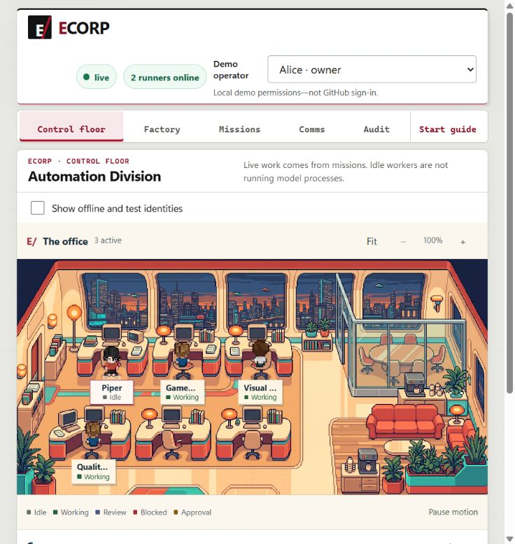

# Unified workflow and exact-run review: local browser evidence

Date: September 7, 2026. This is local development evidence, not hosted CI,
production authentication, or a completed acceptance claim for umbrella #145.

## Product changes

- Missions, Factory and Comms navigate to the same mission context. Comments
  explicitly remain discussion, not new tasks, agent instructions or approvals.
- Related-work choices include every available authorized mission/task/run/artifact
  rather than silently truncating each category to two entries.
- Thread replies retain their mission context in Factory. Work links name the
  actual task or mission rather than presenting only opaque IDs.
- Live-run counts exclude completed provider sessions waiting for evidence review
  and verifier-only execution. Results count completed missions, not intermediate
  artifacts.
- The default floor distinguishes available workers from offline/test
  registrations, retains active work, and offers an explicit registration toggle.
  Historical inspectors retain the full authorized identity snapshot.
- Disabled evidence decisions explain the actor's role or requester exclusion.
  Development-operator switching is explicitly labeled as a demo, not GitHub login.
- `Evidence for` selects one exact run. Provider evidence, source download,
  automated checks, producing agent and decision controls use that same run/task.
  Submitting a decision pins that run; another review requires a deliberate
  selector or next-review action. An old resumable run is not advertised while
  another run remains unfinished.

The last point addresses the implementation gap in #163. Its full two-pending-review
browser regression remains to be executed; this report does **not** close that issue.

## Factory review is an outcome gate

New factory plans require implicit independent review on provider-backed terminal
outcomes, not every internal handoff. Internal handoffs retain their automated
file, artifact and content checks. Explicit internal review policies are preserved.
Existing persisted missions and approvals are never rewritten.

Terminal means a graph leaf, not merely the greatest depth. A deterministic leaf
with provider-backed ancestry cannot bypass outcome review. Planning and store
validation share the same classification, and a persisted delivery policy applies
to every terminal output, including leaves at different depths.

No native filesystem authorization, shell approval, tenant boundary, source pin,
budget, verifier result or irreversible-effect authorization is bypassed.

## Browser-to-server evidence

The canonical UI is port 15491 and its API is port 18962. The browser remained on
that instance. No demo reset, source-checkout implementation, or new Docker
container was used.

### VendorDesk: a real enterprise application

ECorp generated VendorDesk in the separate private
`shyamsridhar123/ecorp-enterprise-lab` repository, through Factory issue #1:

- Mission: `03f0acfa-1278-44db-910b-b1a0acde0bcf`.
- Integration run: `bfdef88c-f7f8-440c-b426-03972ff4cdf8`.
- Three actual Copilot specialist handoffs followed by integration.
- Five persisted checks passed, including seven HTTP tests.
- The final browser decision was accepted as development Bob; requester Alice
  remained ineligible under the existing independent-review policy.

The generated application, not a replacement implementation, was then exercised
in the browser on port 15501 with synthetic fixture accounts:

1. Empty and incorrect credentials fail access; requester login succeeds.
2. Empty request fields produce linked errors and a focused error summary.
3. A requester creates a request and sees attributed audit history, without
   reviewer decision controls.
4. Search and combined risk/status filters hide and restore matching requests.
5. Logout removes the authenticated requester's navigation.
6. A different reviewer starts review, cannot approve without a reason, can cancel
   the decision form, and can approve with a persisted reason and version change.
7. A second request follows the rejection path with the correct actor and reason.
8. A Beta tenant reviewer sees neither Alpha's list data nor an Alpha deep link.
9. Normal keyboard search clearing restores both saved decisions; keyboard link
   activation opens the selected record.
10. At 390 pixels the table becomes cards without document-level horizontal
    overflow; page reload preserves the approved record and its audit.

The detailed local record contains 16 bounded checks. It is not a penetration test
or an assertion that every possible application behavior is correct. The browser
tool's empty-string `fill` did not clear an input; actual Ctrl+A/Backspace was
tested successfully instead. That tool observation was not filed as an app defect.

### Shared discussion and exact-run selection

In ECorp's own browser, Bob posted from VendorDesk's Factory item, then Alice
replied in its Comms thread. Both messages appeared back in the same Factory item:

- Root message: `c8ce7361-0826-40bf-9ce8-57785d0cc3e3`.
- Reply: `9e97ef88-c458-4979-a13d-ff3bec8f33de`.
- The snapshot retained two missions and five runs: discussion created no work.

Selecting VendorDesk's quality run changed the displayed artifact, source form and
checks together. Its historical run did not inherit the integration run's Resume
action. Selecting integration restored the exact commit/branch deliverable and
five-check result. Older run-bound totals that have left the bounded event snapshot
remain labeled unavailable rather than invented.

### Incident Arcade: new real-provider checkpoint

The separate demo task prepared an original enterprise training game. The native
Factory preflight rejected a 120-second browser verifier **before claim** because
the existing ceiling is 60 seconds. Only that timeout and its prose were narrowed;
all six browser cases, assertions, screenshots and source scope were preserved.

The corrected native dry run returned valid, four tasks, exact source
`shyamsridhar123/ecorp-arcade-lab`, `main` at
`d6343f598280e986c43a32082e7f361a9af9ce22`, and no mutations.
The native preflight response contains a summary, not an exact operation byte count
or a full per-task graph.

A tool-policy denial prevented replacing the existing background watcher. It was
left untouched and paused. One native Factory intake cycle admitted only arcade-lab
issue #3; ECorp owns all subsequent task dispatch and dependency release. This is
not a claim that the enterprise-repository watcher watches the arcade repository.

At `2026-09-07T14:43:02Z`, the authoritative snapshot recorded:

- Mission `32d82858-0e38-43db-bf77-eb431ba0bda8`, running.
- Factory item `f5300ed5-2e93-4390-9dd8-6264eda26c48`, running.
- Three root runs simultaneously running on `issue48-real-copilot`, all
  `execution_mode=provider`, `gpt-5.6-sol`, medium reasoning, with distinct real
  Copilot session IDs.
- Each root's exact scoped handoff had three automated checks and **no manual gate**.
- Integration remained pending, with 12 checks and one requester-excluding
  independent-review gate.
- Zero pending tool approvals and zero pending evidence reviews at that checkpoint.

This is simultaneous specialist work followed by implementation, not three
simultaneous game implementations. The checkpoint is not a completed-game,
publication or merge claim. The separate demo task retains the later rehearsal
record and reader-facing demo kit.

### Failed rehearsal and native recovery

The first two automatic attempts of all three roots subsequently failed with
`source deliverable storage acknowledgment timed out`, despite passed check rows
and persisted source deliverables. The mission failed while its one-shot Factory
item still reported running. Those failures and worktrees are preserved.

The live client was starting a full snapshot fetch for every streamed event.
Server logs recorded slow snapshot transactions and connection acquisition; a
refreshed client remained on Authorizing. #168 tracks that read-pressure defect,
and #169 tracks the separate failed-mission/Factory-state mismatch.

The client now coalesces bursts, allows one in-flight snapshot and one trailing
refresh, aborts disposed read scopes, and handles read errors. Initial connection
has a 30-second bound and an explicit Retry connection action. No mission reset
is offered as a connection remedy.

After detaching the overloaded clients and reopening with that patch, explicitly
authorized native Resume operations reused the preserved root sessions/worktrees.
Systems, visual and quality handoffs completed, without human handoff reviews.
The mission, original source, failed history and 2,000,000-token authority stayed
unchanged. This was operator-assisted recovery, not an uninterrupted successful
first attempt.

During quality recovery `0fda7111-2752-480b-be74-1f8e4d34bbfd`, one uninterrupted
browser test reloaded the page. The workspace became visible in **3308 ms**, with
the same mission and run still Running before and after. This separate successful
recovery-phase drill does not relabel the original failed refresh.

Integration run `ba7f676b-c364-484a-9a90-cb4db11fbfe8` then started automatically.
Its `run.dependency_context` receipt (sequence 5421) binds all three accepted
recovered handoffs to the exact parent artifacts/file hashes. The integration
checkpoint is still not a verified, playable-game outcome.

### Accepted game outcome, with a manual-preview limitation

The first integration passed all ten engine tests, but its browser harness counted
intentionally hidden terminal controls as zero-size touch targets. Its report also
used descriptive input-mode labels rather than the frozen validator's exact
`keyboard`/`touch` values. The failures remained real verifier failures; they were
not ignored or approved.

The same issue and mission received native source-correction recovery
`55c5d1bd-74de-44d4-8812-c42df4d140b8`, producing run
`800bb260-7071-43bc-ace0-c45a4e98e231` in the preserved integration workspace.
The correction retained the engine and all 12 checks. The corrected test measures
actually visible controls, still checks the active/paused states, and retains all
six browser cases, real input, error, overflow and screenshot assertions.

The corrected run passed all 12 persisted checks, including ten engine tests and
six actual runner browser cases. Its immutable native source package was
downloaded and SHA-256 checked:

- Head commit: `863922e4ef612d7886c6ef798c1a2831b80e4761`.
- Verification: `c0072bec2b16468e48ae5aa5ca5a92ca4cb6c9a00090def8c99d1aa08fa01fee`.
- Source package: `8e9c6db1c36829d8d7db80c9eb70a9077d0821f1d5d4e91726fede7fdd84f80d`.
- All 17 delivered file hashes were checked before review.
- Engine worktree SHA-256 remained
  `06f014d7604893e5b68dac9de796d5510933b01b488e12a0033b5d7fcf619353`.
  Native Git delivery normalizes CRLF to LF; the exported engine is
  `b170e0be12f35274152a7eda6357ecc7c07aa94a8ea88ad35c8ac6fa49f40f31`,
  with only that verified newline normalization differing.

The parent reviewed the source, browser-test code, real recorded results and inert
screenshots. A separate host-play attempt was blocked by local tool/browser
security policy. No alternate browser, relay, raw CDP or execution workaround was
used. **Manual host play and the user's final dress rehearsal are not claimed.**

The limitation and review basis were recorded in mission-linked Comms. The browser
showed Alice's requester exclusion, focused the demo-operator control through its
guidance button, then allowed eligible development Bob to accept the exact
corrected run. At `2026-09-07T16:08:35Z`, fresh server readback confirmed:

- Mission completed, all four tasks complete.
- Corrected run completed with verification passed.
- Independent-review decision approved by development actor Bob.
- Factory item verified.

This is development-principal review, not proof of a separate human GitHub login.
There was no game branch push, PR, merge or deployment. The initial failures,
operator-assisted recoveries and manual-preview limitation remain part of the
demo record.

## Local validation and deployment

- Migration checksum check: passed, 38 migrations.
- `cargo fmt --check`: passed.
- Workspace/all-target Clippy with warnings denied: passed.
- Complete Rust suite with `--test-threads=1`: **341 passed, 10 existing opt-in
  database tests ignored**.
- The initial parallel workspace run recorded four Windows fixture observation/
  startup timeouts. That failed log is retained; it is not presented as passing.
  No test assertion was weakened or test disabled to obtain the serial result.
- Frontend tests, including snapshot-pressure regression: **92 passed**.
- New API-only review fixture helper: syntax checks and **14 offline tests passed**.
  Those mocked tests do not prove its live fixture or browser behavior.
- Web production build, web lint and diff whitespace check: passed.

The new server binary has SHA-256
`4a767b643c01c29e149a3f18edfcd8fdafa5e540595b315683d3ea605c7bb26d`.
An in-place copy was refused because the old executable remained locked after
the recorded idle process exited. A versioned runtime binary was used instead;
no other process was stopped to release that lock.

The same browser reconnected. Both previously completed missions, all five previous
runs and the two existing runner identities were rechecked after the update.
No history, artifact, verifier policy or worktree was deleted.

## Remaining acceptance

- The isolated two-review acceptance was subsequently completed in two retained
  missions. The first exposed a page-reload selection gap, which was fixed before
  a fresh full patched-UI pass. See the
  [dedicated #163 browser report](2026-09-07-evidence-selection-browser.md) for
  exact decisions, downloads, role checks and measured narrow-screen evidence.
- User-operated manual play and final presenter dress rehearsal remain open.
  The accepted native outcome above does not turn a blocked host-play attempt
  into a passing manual browser check.
- Factory heartbeat presentation can become stale between snapshot refreshes:
  a fresh API read showed the still-live paused watcher's newer heartbeat.
  Distinguish that presentation gap from a failed watcher.
- Keep #145's larger-scale artifact, operating-flow and publication acceptance open.
- No PR publication, merge or deployment of these generated application outcomes
  was performed in this checkpoint. GitHub Actions credits were not used as evidence.

Local raw evidence is retained under the canonical checkout's
`output/playwright/ecorp-ui-audit-20260907` and the trusted live runtime's
`incident-arcade-demo-20260907` directory. These are evidence stores, not the backlog;
GitHub Project #3 and its issues remain the operational queue.

## Subsequent September 7 store verification

The ordinary post-dispatch Factory failure/recovery patch for #169 was independently
reviewed and passed **23 actual-store SQLx tests** under real migrations. This
does not close the missing/delayed-ack server/runner/UI acceptance. The
[store failure report](2026-09-07-factory-run-failure.md) records the exact scope,
source hashes, earlier fixture failure and remaining runtime work.
