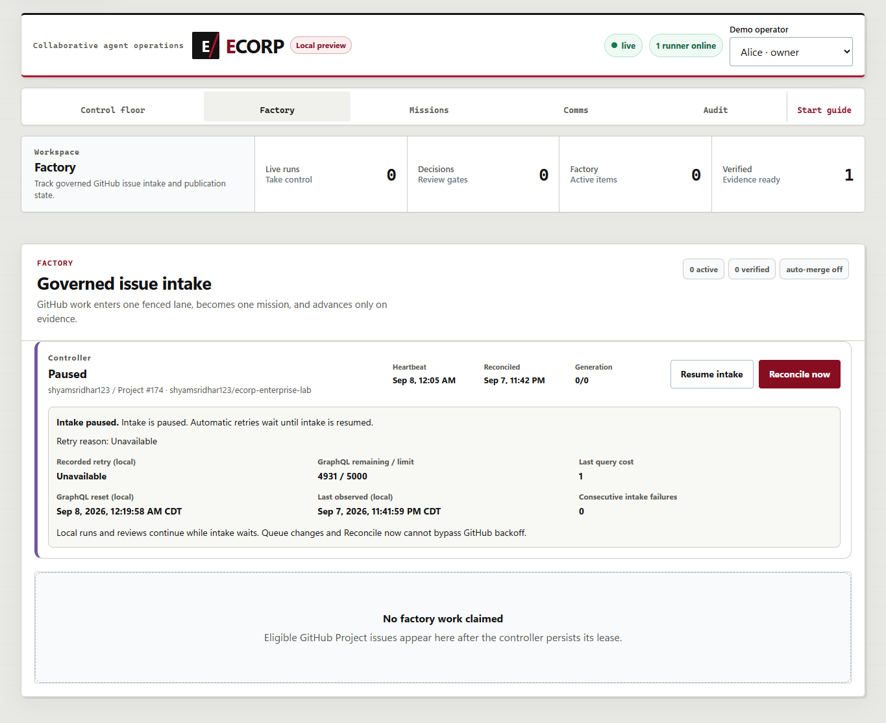
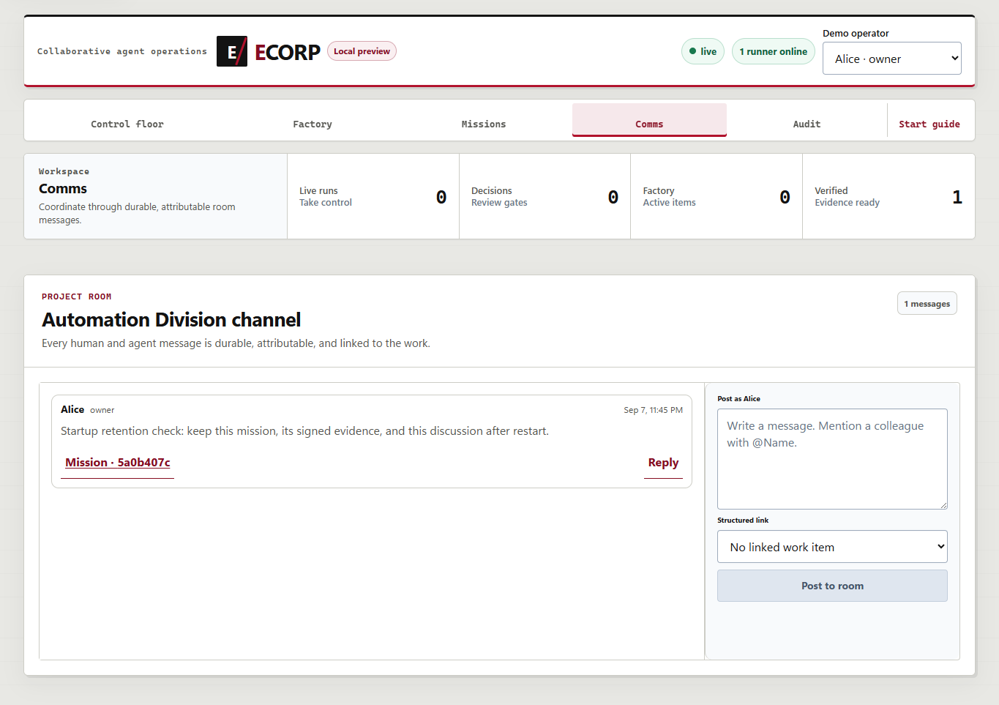

# Local start, restart and retained work

- **Issue:** #174
- **Observed:** September 7–8, 2026, America/Chicago
- **Independent source base:** `18cd802161c9ce0a697f5620da3df1041b4d097f`
- **Branch:** `codex/issue-174-local-start`

## Outcome

The supported Windows command now reuses a healthy owned stack instead of stopping everything,
deleting credentials and creating another enrollment. Explicit restart/stop remain separate.
Concurrent commands for the same checkout use a native named mutex; an interrupted command does
not leave a lock file that an operator must delete.

Process control checks executable, creation time and workspace. Literal bracket/space paths,
atomic state replacement, reused PIDs, legacy records and failed-start cleanup have dedicated
regressions. A missing local credential cannot silently re-enroll an identity already present
in the server's persisted runner list. Custom Factory identity/Project/repository settings and
the native Copilot home are retained. Enabling a missing Factory worker does not restart a
healthy API, runner or UI.

## Local checks

| Check | Observed result |
| --- | --- |
| Immutable migrations | 36 passed on this independent main-based checkout |
| Rust format | Passed |
| Workspace/all-target Clippy, warnings denied | Passed |
| `RUST_TEST_THREADS=1 cargo test --workspace` | 248 passed; 0 failed; 0 ignored |
| Frontend tests | 46 passed |
| Web build and lint | Passed |
| Final lifecycle + operation tests | 34 passed; 0 failed; 0 skipped |
| PowerShell fixture runtime | 7.6.5; module suite reaped all 14 synthetic processes |
| Whitespace/scope checks | Passed |

The four reviewed startup findings were corrected and covered: native startup-recovery opt-out
forwarding, existing-identity enrollment protection, exact-root rollback on ownership-save
failure, and absolute verification-policy paths. The final missing-Factory configuration change
also passed the actual runtime exercise below.

## Actual browser → server → runner → PostgreSQL

The test used the supported public start/stop scripts, freshly built native binaries, an isolated
database/expiring role in the **existing** ECorp QA PostgreSQL container, and an independent
locally initialized source repository. No new container was created.

The provider was explicitly **Test harness / no AI**. GitHub access used the existing local
`fake_github_cli.mjs` with an empty synthetic Project. Project **174** and the repository label
shown in these screenshots are fixture configuration, not a newly created live GitHub Project or
proof of fetched enterprise-lab source. This is native lifecycle acceptance, not a new
provider-built application or production identity demonstration.

Observed flow:

1. Normal start brought up one API, runner, UI and custom Factory controller at QA ports
   **18574 / 15574**.
2. The real browser selected the immutable source, explicitly enabled developer fixtures,
   chose `fake-process` and a review report, and launched one mission.
3. The native task completed and its dirty worktree reached `preserved`.
4. The browser downloaded the original signed provider artifact and paused Factory through
   the actual control button.
5. A real, attributed Comms message linked to that mission was posted. It created no new task/run.
6. Repeating normal start preserved all **four exact process identities**.
7. Explicit restart replaced those four process identities while retaining the same runner,
   custom controller, Project/repository settings and provider home.
8. SHA-256 fingerprints of all rows in `missions`, `tasks`, `runs`, `room_messages`,
   `artifacts` and `source_deliverables` remained identical. The full original journal prefix
   through **sequence 78**, not merely the bounded browser snapshot, also remained identical.
9. The browser reloaded the completed mission, its linked discussion and paused Factory.
   Both signed artifact downloads matched their stored digest and size: **1,638** and **515** bytes.
   No page errors were observed; the sampled mobile page measured **390/390 px** without
   horizontal overflow.
10. A separate stopped→core-only→Factory-enabled sequence genuinely added the missing Factory
    process without changing any of the three healthy core process identities.

Retained identities:

- Mission: `5a0b407c-52ba-4f8d-aac0-f27c329386a8`
- Task: `3fa6352e-875f-4263-84ae-35b91f9fdb8a`
- Run: `6383f4bb-311a-4d25-bbfa-67208aff771a`
- Controller: `00000000-0000-4000-8000-000000000174`

### Paused Factory after restart

### Attributed discussion after restart

## Retained counterexamples and scope

- A shared Cargo target initially supplied stale domain artifacts from the other worktree.
  The source did not contain the fields named in that compiler error. No Rust workaround was
  added: the failure logs were retained and a dedicated target directory produced the fresh
  passing build/tests above.
- The first browser verifier observed `completed` before the asynchronous workspace disposition
  settled from `active` to `preserved`. Its checkpoint was retained. The verifier then waited
  for the terminal disposition within its existing deadline and continued the **same** run;
  no replacement mission or database edit manufactured success.
- Harness-only mistakes—a trailing newline in the protected-config loader and incorrect
  `messages` / `byte_count` field assumptions—were corrected against the native interface.
  The same message and artifacts were retained, not recreated.
- Synthetic Win32 rollback-result checks do not claim forced kernel-failure coverage.
  This is not a global process-containment, cross-host coordination or production-authentication proof.
- Custom service keys and provider credentials still come from trusted host configuration.
  They are not persisted in the public process record; environment delivery remains reduced assurance.

Only this test's four owned service roots were stopped afterward. Ports **18574 / 15574** were
verified free. The original listeners on **18961 / 18962 / 15491** still reported their original
PIDs and were not targeted. Test data, private credential files, logs and the preserved worktree remain available.
There was no restart of the original manual/other-QA services, manual-data reset, generated-application publication,
merge, auto-merge, production deployment or hosted Actions result.

The machine-readable companion is
[`2026-09-08-local-start-validation.json`](2026-09-08-local-start-validation.json).
