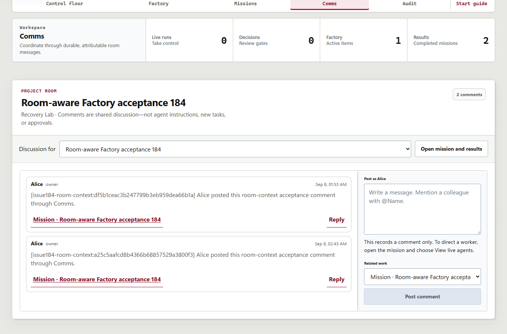
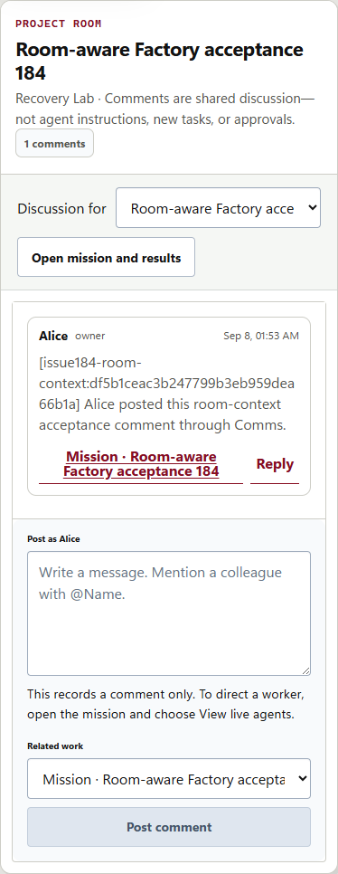

# Room-scoped discussion and truthful mission origin

- **Issues:** #184 and #185, addressing the remaining #175 review findings.
- **Observed:** September 8, 2026.
- **Rebased layer:** `304a60be19a0661f25bf8b4b2babfa633f43a111`, after #162 merged.

## What changed

Selecting a mission or following **Discuss this mission** now resolves its authoritative
owning room. Messages, replies and related-work choices stay in that room and mission.
Actor/Corp/room/mission changes invalidate stale submissions and late responses; a vanished
selection cannot silently rebind a draft to the first room. Native server membership and
room-link validation remain unchanged.

Missing Factory items no longer establish a Direct origin. Known item/publication/recovery
links retain positive Factory attribution; otherwise the UI uses neutral, explicitly
unavailable origin language. Guest filtering and the bounded 500-item projection do not
cause false Direct labels or reveal hidden intake details.

Long message identifiers also wrap without clipping the timestamp or Reply control.

## Local checks

- Lower-layer focused projection/workflow/evidence tests: **41 passed**.
- Complete lower-layer frontend suite: **115 passed**.
- Rust workspace: **341 passed**, 23 opt-in database cases ignored.
- All 38 migration checks, formatting, workspace/all-target Clippy with warnings denied,
  web build/lint and native server/runner/CLI binaries passed.
- Startup/operation regressions: **34 passed**; 14 owned synthetic processes reaped.
- Source stayed unchanged during the complete gate invocation recorded at
  `validation-20260908T073108258/result.json` under the operator #183 evidence directory.

## Browser and native-state acceptance

The retained #174 QA database, runner credential, source checkout, object store and workspace
were reused on ports **18574 / 15574**, without a new container or data reset.
Only new, explicitly scoped QA room/membership fixtures were seeded. ECorp's native Factory
preflight, claim, materialization and launch APIs created one new mission; its real
`fake-process` child completed and Factory became verified. This is deterministic
systems acceptance, **not an AI-generated application or a live GitHub Project claim**.

- Mission: `13dcdd66-c613-4378-8490-3a5e916036b2`.
- Owning room: `00000000-0000-4000-8000-000000000184`, Recovery Lab—not Alice's first room.
- The first cumulative-UI pass posted message `234e82e0-c714-4007-9cb8-36666578c365`.
- After reconciling the patch into its actual lower stack layer, the complete browser pass
  ran again against **that layer's UI and server binaries**, with the same mission/data.
  It posted message `feae3a5a-df3b-498b-ab6c-565ed58984e8`.
- Each pass made exactly one marked UI comment POST and verified its persisted body,
  Alice attribution, room and mission link through the native snapshot.
- Both selector and deep-link entry paths selected the correct room. Reload retained the
  same message. Bob retained a positive first-room control but saw none of the target
  room/mission/comment. Guest Eve saw the authorized mission/comment without a false Direct label.
- Desktop and 390-pixel views had no page errors, mocks, injected page data or out-of-scope requests.

### Visual counterexample and correction

The initial document-width test passed, but visual inspection found the long test marker
clipping the timestamp and Reply inside the message list. That screenshot remains retained;
document width alone was insufficient.

The six-rule grid/flex/wrapping correction was verified read-only against the original
persisted message, without another comment. Panel/list/message/footer measured
**372/346/312/288 CSS pixels**, each with identical client and scroll widths. Reply remained
inside the message bounds with a 44-pixel height. The later complete lower-layer pass
also used this corrected CSS.

## Scope and retained records

The browser receipt is [recorded separately](2026-09-08-room-context-browser.json);
the nested-layout measurement is [retained here](2026-09-08-room-context-wrap.json).
The actual lower-layer App SHA-256 was
`5E453848F4D8B0E747F415F4812DDE6C81815D7277369CA583868C92E08585C6`;
CSS was `E11011C9F537968FA950114421FE42FE22FC4074395E2F694BF5C5BFB9F9495E`.

A fixture-only preflight typo (`review_report` instead of native `review_only_report`)
was rejected before claim. Its error and the original room/actor were retained, then that
same fixture continued. The expired isolated QA database-role lease was renewed without
changing its password or creating another identity. Earlier signed downloads remained
byte-identical at 1,638 and 515 bytes.

These are development principals, not production GitHub authentication. Existing manual
listeners and the unfinished #172 runner-fairness lane were not restarted or changed.
No hosted Actions, auto-merge, production deployment or manual-instance promotion is inferred.
