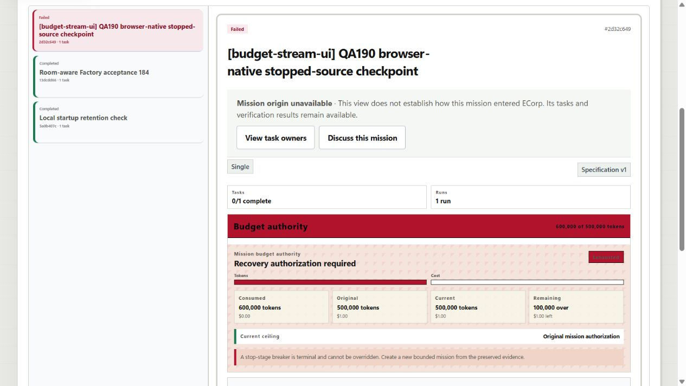
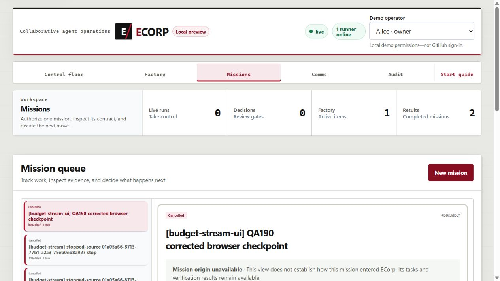

# Native stopped-source checkpoint emission

- **Issue:** #190, first implementation layer of #148.
- **Source base:** `d1d9dcc113345486a1fb7abbe4365707bd514521`.
- **Observed:** September 8, 2026, Windows.
- **Status:** checkpoint emission accepted through the server/runner and browser;
  full budget recovery remains unproven.

## Implemented boundary

The runner reuses native `CircuitBreaker` delivery, workspace verification and
fingerprinting, and the existing `run.workspace_preserved` event. No second
execution loop, approval API, checkpoint database, or provider session is added.

A hard directive received before ordinary verification wins over a late provider
`Completed` result. The provider stops first. The runner then reports retained
source before its native terminal event rather than entering ordinary verification.
The source-checkpoint proof binds Corp, mission, task, run, workspace, agent and
runner identities; the original repository/ref/base; current branch and HEAD;
the workspace fingerprint; and hashes of the verifier, write-scope and deliverable
policies. The proof contains no assignment credential or absolute host path.

The existing workspace predicate verifies the managed root, branch and original
base ancestry before and after reading bytes. HEAD must remain unchanged during
capture. The checkpoint-only read has a 4 GiB ceiling and a cooperative read
deadline; an overall ten-second capture deadline releases terminal reporting
through the retain-without-proof fallback. Ordinary workspace fingerprints keep
their existing semantics. This is not a claim that the operating system can
forcibly cancel an indefinitely stalled filesystem read.

The fingerprint covers the supported workspace tree, including ignored entries,
and excludes root Git control data. It is not a portable source export. Existing
deliverable filtering and write-scope enforcement still apply to future export.
Unpinned source, uncertain teardown, failed integrity checks, and quarantine do
not produce a trusted proof; retained work is not deleted to make the check pass.

## Late directives and cleanup

Ordinary verification now uses the existing cancellable check execution and
native verifier-process teardown. Its upload acknowledgment wait observes the
same cancellation signal. A hard directive arriving after verification has
started cancels that work and retains the workspace **without** pretending that
post-verifier bytes are a pre-verification checkpoint.

One atomic phase chooses hard-boundary retention or ordinary finalization before
cleanup awaits. A directive that loses to committed finalization is rejected,
not acknowledged as retaining a worktree that cleanup can remove. Only applied
circuit-breaker commands enter the native command-ID cache; a negative
acknowledgment remains negative when the same command is retried.

## Observed verification

The initial native-only repository gate passed:

| Check | Result |
| --- | --- |
| Immutable migration manifest | 38 migrations passed |
| `cargo fmt --check` | Passed |
| Workspace/all-target Clippy, warnings denied | Passed |
| Serial workspace Rust tests | 367 passed, 0 failed, 96 opt-in SQLx cases ignored |
| Runner tests within that gate | 138 passed, including all 16 `issue190_` cases |
| Web build and lint | Passed |
| Whitespace and exact source-hash check | Passed |

The new cases run the actual assignment executor with deterministic in-process
adapter fixtures and real isolated Git worktrees. Late-stop cases hold a real
Node verifier or a native deliverable-upload acknowledgment. Cleanup coverage
holds the real workspace-operation mutex and retries one command ID twice.
Other cases cover suspend/stop, completed/cancelled/failed exits, runtime
uncertainty, unpinned source, policy/content binding, branch/base mismatch,
quarantine, byte limits, and blocked capture deadlines.

Independent source review exposed the late-verification, capture-duration and
finalization-window gaps. They were corrected and the regressions expanded.
The earlier 11-, 15-, and 16-case focused outputs remain in the task transcript;
that full gate additionally covers the command-ID replay assertion.

Exact commands, original output, and hashes for all four product files are in
`C:\Users\shyamsridhar\.codex\dogfood\remaining-work-20260908\issue190-20260908T111437742\result.json`
and its adjacent logs. The full gate completed at `2026-09-08T11:22:19Z`.

## Limits of the initial native-unit checkpoint

Those initial checks did not prove server receipt/persistence of the new proof,
browser acceptance, a real vendor run, or full #148 recovery. The follow-up below
adds scoped server/browser evidence, not a real-vendor or full-recovery claim.
The existing store,
source-correction, generic resume, budget/attempt, review and publication gates
are unchanged. In particular, budget-stopped sources are not newly admitted to
verifier-only recovery by this patch.

Next layers must validate the persisted checkpoint in the existing recovery
aggregate, preserve original spend and lineage, run the unchanged verifier policy
without a provider, create the required non-empty verification bundle, and prove
authorized review/publication and restart/tamper negatives. A late stop after
ordinary verification begins still lacks an original pre-verification checkpoint.

No manual service, runner identity, provider home, application database, retained
mission, or protected #172 QA relay was changed. No container, real-provider run,
hosted Actions, auto-merge, or deployment was used for these checks.

## Server/browser follow-up: retained failure and correction

The separate, previously owned QA fixture at API `18574` / UI `15574` was reused
without a new container or database reset. Its expired test-role login lease was
renewed without replacing the password or privileges. Existing source, workload
credential, signing configuration and history were retained. The manual app and
the protected #172 transport were untouched.

A browser-created 500K-ceiling mission using `[budget-stream-ui]` received 600K
**synthetic protocol tokens**, not vendor inference or billing. Its exact file
check and `base.txt` write scope were submitted through the real composer.
Mission `2d32c649-9251-4781-acdc-2af330db6ab1`, run
`f345625a-5df4-4b21-bcf8-7b6e7190a736`, remains a retained failure:

- hard stop followed the two native usage events;
- the adapter's final local transcript became an attempted post-stop upload;
- the server rejected that upload and recorded failure before termination
  telemetry could be accepted;
- checkpoint evidence and original source were preserved, but the required
  termination/checkpoint sequence was **not** proven.

The native executor regression was expanded to emit an adapter artifact after a
hard directive. Against the prior sink it failed **0 passed / 1 failed**, exit
101. The fix now ignores artifact egress before file reads when that assignment
has already received a hard directive. Transcript bytes remain in the retained
worktree; no rejection or fabricated accepted artifact is substituted.

The corrected source passed the full local gate: **368 Rust tests**, including
**17 new checkpoint tests** and **139 runner tests**, with 96 opt-in SQLx cases
still ignored; migration/format/Clippy/web/whitespace checks passed. The additive
API driver and protocol-fixture regressions passed **95 pure Node tests**.
The driver has no reset, enrollment, SQL, policy-revision or provider-resume path.
The original `[budget-stream]` remains 3K twice; the explicit UI-only marker is
300K twice to exercise the UI's unchanged 500K preset.

This correction does not resolve an artifact already queued before control
delivery; exact-assignment late termination telemetry is tracked in #193.
The wider #148 recovery-to-publication acceptance remains separate.

Original screenshots, the failed browser snapshot and red-test output are under
`C:\Users\shyamsridhar\.codex\dogfood\issue190-runtime-20260908`.
The corrected source gate is
`C:\Users\shyamsridhar\.codex\dogfood\remaining-work-20260908\issue190-runtime-fix-20260908T121229935\result.json`.
Corrected-candidate server/browser acceptance must be recorded separately; the
failed browser run is not overwritten or relabeled as successful.

## Corrected-candidate runtime acceptance

Candidate `fb6c526c6272e30c6169b453e42aa58aadd3e77f` passed the additive native
API cases and a new browser-created case:

| Case | Original ceiling | Synthetic usage | Persisted outcome |
| --- | ---: | ---: | --- |
| API suspend | 6,000 | 6,000 | Cancelled, source checkpoint preserved |
| API stop | 5,000 | 6,000 | Cancelled, source checkpoint preserved |
| Browser stop | 500,000 | 600,000 | Cancelled, source checkpoint preserved |

The API cases retained run IDs `fb798400-6532-4c52-a42f-6a37a00fbc12` and
`3e19a177-4c5b-443b-9c54-5fb93ecd801b`. Complete actor-visible journal replay
proved usage → hard breaker → command acknowledgment → provider termination →
checkpoint → terminal ordering, with one task/run/attempt per case, exact source
and policy bindings, zero accepted artifacts/completion, and no automatic retry.

The driver initially rejected the valid native `healthy` breaker projection
because its local schema incorrectly named it `none`. That checker failure was
retained; its already-launched suspend case was continued with the **same run ID**,
not replaced. The corrected checker uses the migration's exact enum and rejects
`none`; all **96 pure driver/protocol tests** passed.

The corrected browser mission `b8c3db6f-5e92-4973-8c98-e05a13e9b269` produced run
`b5db42f9-26a6-4a95-846a-0cfc2c0c8cc1`. Its persisted sequence is:

```text
188–189  synthetic usage
190      hard breaker
191      native command acknowledgment
192      provider terminated
193      source checkpoint preserved
194      run cancelled
```

The real browser submitted the unchanged 500K preset, exact source, `base.txt`
write scope and file verifier. Reload showed the same cancelled run, explicit
hard-stop reason and preserved-worktree detail, with zero browser console errors.
The source file's exact five bytes and all three policy digests were independently
checked. This proves the intended stopped-source outcome, **not** a completed app.





[Bounded runtime receipt](assets/stopped-source-checkpoint/runtime-summary.json)
records IDs, digests, ordering and scope. Original two-mission/two-run database
fingerprints matched exactly after the probe; the database contains six retained
missions/runs and zero active runs. The initial failed browser run remains intact.
The configured source checkout is unchanged.

Only the QA runner was replaced for the correction. The QA server/UI remained
running until acceptance finished, then all three QA processes and the temporary
browser tab were closed. Ports 18574/15574 are free. The manual app and protected
#172 API/relay retained their original process identities; no container or
database was created or reset.

The manual-origin label still reports unavailable for these browser-created
missions; this separate UX observation is recorded under #145. #193's
already-queued-upload race and the remaining #148 verifier-only recovery,
publication and original-source guarantees are not waived by this acceptance.
