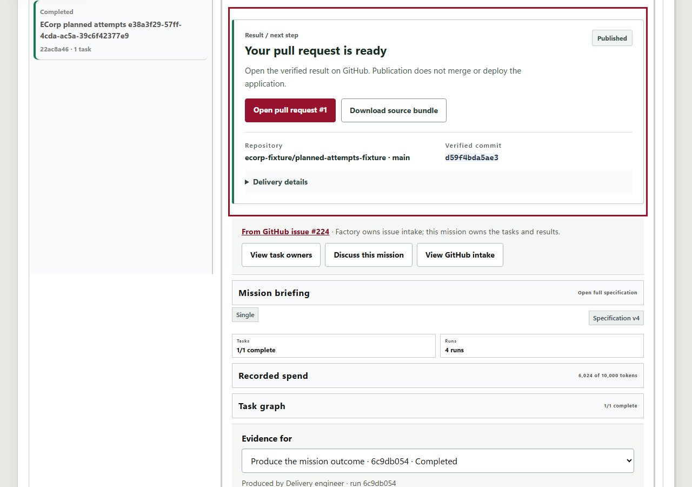

# Recovery stack and scheduler acceptance

September 12, 2026. Scope: user-authored PRs #179, #212, #214, #215,
#217, #218, #227 and #229. Recovery, repeated correction, publication and
two-runner retention acceptance now pass. This report supersedes the earlier
pending-runtime status without erasing the retained failures.

The recovery candidate has tree `f989580c03853a9d49fb6078dd3ecbac665ba692`.
Adding the unchanged #179 scheduler patch produces
`b2f0771599e5ec56ac611d1746058ebda5903fce`. The
[machine receipt](2026-09-12-pr-stack-validation.json) records source objects,
log hashes, case identities and limits. Documentation and the optional
publication-fixture configuration were added after the native gates; the
configuration was exercised through the integrated public driver.

## Gates

| Check | Fresh result |
| --- | --- |
| Recovery Rust workspace, serial | 540 passed; 0 failed; 323 deliberately ignored |
| Recovery plus scheduler Rust workspace, serial | 547 passed; 0 failed; 323 deliberately ignored |
| Workspace/all-target Clippy and formatting | Passed for both candidates |
| Actual-migration SQLx cases | 122 distinct passed; 0 failed; 0 ignored in this lane |
| Scheduler regression and existing readiness cases | 7 issue172 + 9 issue171 passed |
| Frontend | 250 tests passed; build and lint passed |
| Immutable migrations | All 41 passed |
| Native services | Six recovery executables built; combined server separately built and hash-bound |

The SQLx filters cover prospective attempts, native verifier seals, retry
ancestry, correction/publication admission and retained receipts. They use a
dedicated maintenance database and SQLx-created databases in the isolated QA
PostgreSQL container. They do not operate on the running application's database.
Ignored ordinary-workspace tests are not counted as passes.

## Public repeated correction

The unchanged default driver completed mission
`22ac8a46-3a82-4b3d-aa3e-71c4eca87730` through one initial provider attempt,
one provider-free checkpoint verifier, a genuinely failed correction and a
successful final correction. The attempt sequence is **1 -> 1 -> 2 -> 3**.

The final run `c905d183-4851-43da-9afa-24a56067bce5` passed the same four
checks and Bob's independent development-principal review. Factory reached
`verified`, the mission completed and remaining attempts reached zero.
All original history and source bindings were retained. Recorded fixture
usage remained 6,024 tokens within the original 10,000-token mission budget;
the pre-run task boundary remained 5,700. No counters or historical grants
were repaired. This exercises the P1 reported on #212 and the fixes in #227/#229.

## Publication with authority declared before execution

The default case correctly rejects publication because its original policy
did not authorize that effect. That case was preserved unchanged.

`tools/e2e_planned_attempts.mjs` now accepts an optional boolean
`allow_fixture_publication` in its explicitly owned test context. Only true
adds the existing review-only publication policy **before claim**. Omitted or
false retains the original policy. String and null values were rejected before
execution. The driver still invokes no publisher or Git/GitHub command.

A separate case, mission `bc0bb425-bf22-4ba5-a2fd-5115bc990910`, passed the
same three-attempt sequence with this initial policy. The native trusted
publisher then published its accepted bundle to an isolated bare Git remote
and the existing fake-GitHub protocol boundary:

- Source deliverable: `d60cfd4d-7553-4c69-87e7-fcf98e365f3a`.
- Source SHA-256: `e1804f20d213d060022e7786935582c129a1d98dc26f67ec642d364b5646a824`.
- Verified and published head: `d59f4bda5ae382c7c30156d5ca056e2ef62611d5`.
- Publication: `5242ae5f-8755-4d46-b2dd-bc6b52ebe421`, state `published`.
- One PR creation and one Project transition to `In Review`, including a duplicate invocation.
- Original local `main` remained `f9f51d0d30065f796ab9e0d150e9aedb3e0c1325`.
- No additional provider run, changed spending, replaced review or rewritten source provenance.

This is fresh native publication acceptance for the corrected lineage. The
fixture PR URL is metadata, not a real GitHub publication or merge.

## Scheduler and browser

The combined server was started using the same QA database, service keys,
artifacts and existing runner. A separately credentialed temporary runner
connected to the identical source tuple. The before/after verifier compared
all four original runs, task attempts, mission accounting, recovery records,
verification, review and signed source-download bytes. They remained identical.
Reconnection replay was ordered and contained no duplicate events. The
temporary peer was subsequently revoked and stopped using its recorded process
identity. The original QA runner remains available.

The 16 scheduler tests establish bounded selection, failed-representative
rotation, epoch fencing, churn and cross-Corp fairness. The live lane establishes
two-runner reconnect/retention compatibility; it does not inject persistent
command failure into a vendor-backed runner.

The actual web client showed completed work, all four selectable histories,
the failed correction, and the published result. Selecting an earlier run
offered **Go to delivered result**, which selected the accepted run and showed
**Your pull request is ready** with the exact fixture PR link. The guest could
not read this private mission. At a 390-pixel viewport, client and scroll width
both measured 390, with no error overlay or observed console exception.

Additional images retain the completed, failed, guest and mobile views. The
automation's browser file-save command was canceled, including an independent
control download. File saving is therefore excluded from passing browser
evidence. Authorized API downloads and the native publisher verified the actual
source byte hashes and signature bindings.

## Boundaries

The native protocol fixtures launch real local child processes but do not
claim new vendor inference, vendor session persistence, independent client
signature verification or production OIDC identity. Prior real-Copilot and
stopped-session diagnostic evidence remains separately scoped. In particular,
#214's bounded diagnostic does not make unsupported historical SDK reads work.

The normal ECorp deployment and its retained data were not reset or repurposed.
All local QA artifacts, failed probes and service identities remain retained.
This evidence does not change repository protection or itself authorize merge.
Hosted results remain attached to their actual PR heads; no older failing or
skipped check is relabeled by this local report.
